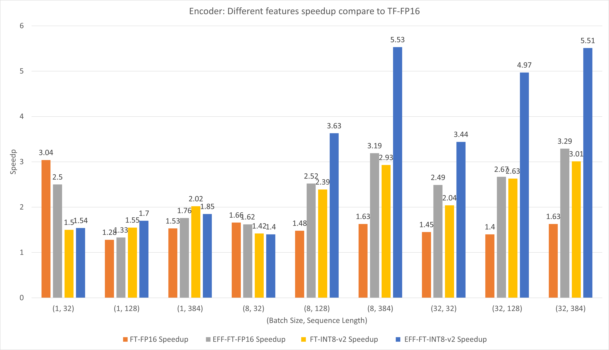
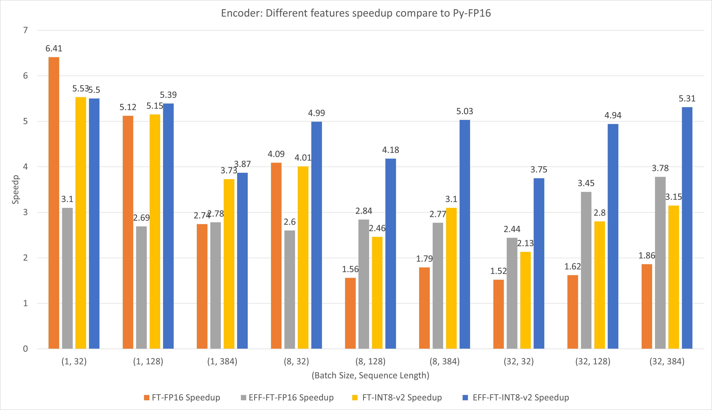
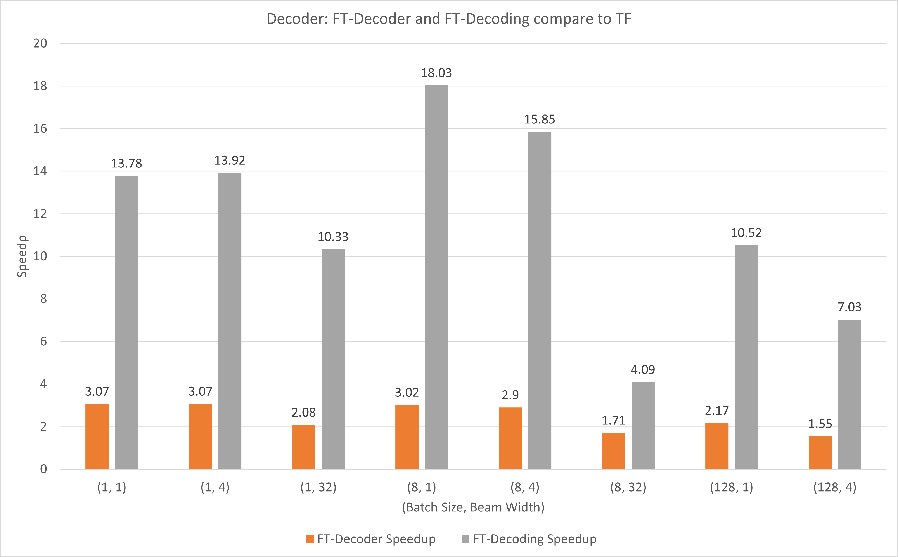
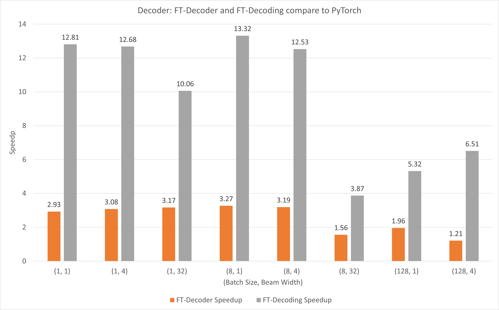
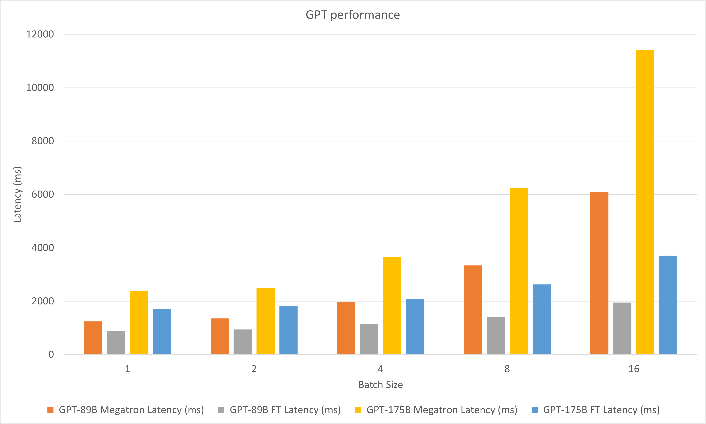

# FasterTransformer

This repository provides a script and recipe to run the highly optimized transformer-based encoder and decoder component, and it is tested and maintained by NVIDIA.

## Table Of Contents

- [FasterTransformer](#fastertransformer)
  - [Table Of Contents](#table-of-contents)
  - [Model overview](#model-overview)
    - [Support matrix](#support-matrix)
  - [Advanced](#advanced)
  - [Performance](#performance)
    - [BERT base performance](#bert-base-performance)
      - [BERT base performances of FasterTransformer new features](#bert-base-performances-of-fastertransformer-new-features)
      - [BERT base performance on TensorFlow](#bert-base-performance-on-tensorflow)
      - [BERT base performance on PyTorch](#bert-base-performance-on-pytorch)
    - [Decoding and Decoder performance](#decoding-and-decoder-performance)
      - [Decoder and Decoding end-to-end translation performance on TensorFlow](#decoder-and-decoding-end-to-end-translation-performance-on-tensorflow)
      - [Decoder and Decoding end-to-end translation performance on PyTorch](#decoder-and-decoding-end-to-end-translation-performance-on-pytorch)
    - [GPT performance](#gpt-performance)
  - [Release notes](#release-notes)
    - [Changelog](#changelog)
    - [Known issues](#known-issues)

## Model overview

In NLP, encoder and decoder are two important components, with the transformer layer becoming a popular architecture for both components. FasterTransformer implements a highly optimized transformer layer for both the encoder and decoder for inference. On Volta, Turing and Ampere GPUs, the computing power of Tensor Cores are used automatically when the precision of the data and weights are FP16.

FasterTransformer is built on top of CUDA, cuBLAS, cuBLASLt and C++. We provide at least one API of the following frameworks: TensorFlow, PyTorch and Triton backend. Users can integrate FasterTransformer into these frameworks directly. For supporting frameworks, we also provide example codes to demonstrate how to use, and show the performance on these frameworks.

### Support matrix

| Models           | Framework      | FP16 | INT8 (after Turing) | Sparsity (after Ampere) | Tensor parallel | Pipeline parallel |
| ---------------- | -------------- | ---- | ------------------- | ----------------------- | --------------- | ----------------- |
| BERT             | TensorFlow     | Yes  | Yes                 | -                       | -               | -                 |
| BERT             | PyTorch        | Yes  | Yes                 | Yes                     | -               | -                 |
| XLNet            | C++            | Yes  | -                   | -                       | -               | -                 |
| Encoder          | TensorFlow     | Yes  | Yes                 | -                       | -               | -                 |
| Encoder          | PyTorch        | Yes  | Yes                 | Yes                     | -               | -                 |
| Decoder          | TensorFlow     | Yes  | -                   | -                       | -               | -                 |
| Decoder          | PyTorch        | Yes  | -                   | -                       | -               | -                 |
| Decoding         | TensorFlow     | Yes  | -                   | -                       | -               | -                 |
| Decoding         | PyTorch        | Yes  | -                   | -                       | -               | -                 |
| GPT              | TensorFlow     | Yes  | -                   | -                       | -               | -                 |
| GPT              | PyTorch        | Yes  | -                   | -                       | Yes             | Yes               |
| GPT              | Triton backend | Yes  | -                   | -                       | Yes             | Yes               |
| GPT-J            | Triton backend | Yes  | -                   | -                       | Yes             | Yes               |
| Longformer       | PyTorch        | Yes  | -                   | -                       | -               | -                 |
| T5               | PyTorch        | Yes  | -                   | -                       | Yes             | Yes               |
| T5               | Triton backend | Yes  | -                   | -                       | Yes             | Yes               |
| T5               | TensorRT       | Yes  | -                   | -                       | Yes             | Yes               |
| Swin Transformer | PyTorch        | Yes  | Yes                 | -                       | -               | -                 |
| Swin Transformer | TensorRT       | Yes  | Yes                 | -                       | -               | -                 |
| ViT              | PyTorch        | Yes  | Yes                 | -                       | -               | -                 |
| ViT              | TensorRT       | Yes  | -                   | -                       | -               | -                 |

* Note that the FasterTransformer supports the models above on C++ because all source codes are built on C++.

More details of specific models are put in `xxx_guide.md` of [`docs/`](docs), where `xxx` means the model name. Some common questions and the respective answers are put in [`docs/QAList.md`](docs/QAList.md). Note that the model of Encoder and BERT are similar and we put the explanation into `bert_guide.md` together.

## Advanced

The following code lists the directory structure of FasterTransformer:

```bash
/src/fastertransformer: source code of FasterTransformer
    |--/models: Implementation of different models, like BERT, GPT.
    |--/layers: Implementation of layer modeuls, like attention layer, ffn layer.
    |--/kernels: CUDA kernels for different models/layers and operations, like addBiasResiual.
    |--/tensorrt_plugin: encapluate FasterTransformer into TensorRT plugin.
    |--/tf_op: custom Tensorflow OP implementation
    |--/th_op: custom PyTorch OP implementation
    |--/triton_backend: custom triton backend implementation
    |--/utils: Contains common cuda utils, like cublasMMWrapper, memory_utils
/examples: C++, tensorflow and pytorch interface examples
    |--/cpp: C++ interface examples
    |--/pytorch: PyTorch OP examples
    |--/tensorflow: TensorFlow OP examples
    |--tensorrt: TensorRT examples
/docs: Documents to explain the details of implementation of different models, and show the benchmark
/benchmark: Contains the scripts to run the benchmarks of different models
/tests: Unit tests
/templates: Documents to explain how to add a new model/example into FasterTransformer repo
```

Note that many folders contains many sub-folders to split different models. Quantization tools are move to `examples`, like `examples/tensorflow/bert/bert-quantization/` and `examples/pytorch/bert/bert-quantization-sparsity/`.

## Performance

Hardware settings:

* 8xA100-80GBs (with mclk 1593MHz, pclk 1410MHz) with AMD EPYC 7742 64-Core Processor
* T4 (with mclk 5000MHz, pclk 1590MHz) with Intel(R) Xeon(R) CPU E5-2670 0 @ 2.60GHz

In order to run the following benchmark, we need to install the unix computing tool "bc" by

```bash
apt-get install bc
```

### BERT base performance

The FP16 results of TensorFlow were obtained by running the `benchmarks/bert/tf_benchmark.sh`.

The INT8 results of TensorFlow were obtained by running the `benchmarks/bert/tf_int8_benchmark.sh`.

The FP16 results of PyTorch were obtained by running the `benchmarks/bert/pyt_benchmark.sh`.

The INT8 results of PyTorch were obtained by running the `benchmarks/bert/pyt_int8_benchmark.sh`.

More benchmarks are put in [`docs/bert_guide.md`](docs/bert_guide.md#bert-performance).

#### BERT base performances of FasterTransformer new features

The following figure compares the performances of different features of FasterTransformer and FasterTransformer under FP16 on T4.

For large batch size and sequence length, both EFF-FT and FT-INT8-v2 bring about 2x speedup. Using Effective FasterTransformer and int8v2 at the same time can bring about 3.5x speedup compared to FasterTransformer FP16 for large case.

<div align=center></div>

#### BERT base performance on TensorFlow

The following figure compares the performances of different features of FasterTransformer and TensorFlow XLA under FP16 on T4.

For small batch size and sequence length, using FasterTransformer can bring about 3x speedup.

For large batch size and sequence length, using Effective FasterTransformer with INT8-v2 quantization can bring about 5x speedup.

<div align=center></div>

#### BERT base performance on PyTorch

The following figure compares the performances of different features of FasterTransformer and PyTorch TorchScript under FP16 on T4.

For small batch size and sequence length, using FasterTransformer CustomExt can bring about 4x ~ 6x speedup.

For large batch size and sequence length, using Effective FasterTransformer with INT8-v2 quantization can bring about 5x speedup.

<div align=center></div>

### Decoding and Decoder performance

The results of TensorFlow were obtained by running the `benchmarks/decoding/tf_decoding_beamsearch_benchmark.sh` and `benchmarks/decoding/tf_decoding_sampling_benchmark.sh`

The results of PyTorch were obtained by running the `benchmarks/decoding/pyt_decoding_beamsearch_benchmark.sh`.

In the experiments of decoding, we updated the following parameters:

* head_num = 8
* size_per_head = 64
* num_layers = 6 for both encoder and decoder
* vocabulary_size = 32001 for TensorFlow sample codes, 31538 for PyTorch sample codes
* memory_hidden_dim = 512
* max sequenc elength = 128

More benchmarks are put in [`docs/decoder_guide.md`](docs/decoder_guide.md#decoding-performance).

#### Decoder and Decoding end-to-end translation performance on TensorFlow

The following figure shows the speedup of of FT-Decoder op and FT-Decoding op compared to TensorFlow under FP16 with T4. Here, we use the throughput of translating a test set to prevent the total tokens of each methods may be different. Compared to TensorFlow, FT-Decoder provides 1.5x ~ 3x speedup; while FT-Decoding provides 4x ~ 18x speedup.

<div align=center></div>

#### Decoder and Decoding end-to-end translation performance on PyTorch

The following figure shows the speedup of of FT-Decoder op and FT-Decoding op compared to PyTorch under FP16 with T4. Here, we use the throughput of translating a test set to prevent the total tokens of each methods may be different. Compared to PyTorch, FT-Decoder provides 1.2x ~ 3x speedup; while FT-Decoding provides 3.8x ~ 13x speedup.

<div align=center></div>

### GPT performance

The following figure compares the performances of Megatron and FasterTransformer under FP16 on A100.

In the experiments of decoding, we updated the following parameters:

* head_num = 96
* size_per_head = 128
* num_layers = 48 for GPT-89B model, 96 for GPT-175B model
* data_type = FP16
* vocab_size = 51200
* top_p = 0.9
* tensor parallel size = 8
* input sequence length = 512
* ouptut sequence length = 32

<div align=center></div>

## Release notes

### Changelog

April 2022
- Change the default accumulation type of all gemm to FP32. 
- Support bfloat16 inference in GPT model.
- Support Nemo Megatron T5 and Megatron-LM T5 model.
- Support ViT. 

March 2022
- Support `stop_ids` and `ban_bad_ids` in GPT-J.
- Support dynamice `start_id` and `end_id` in GPT-J, GPT, T5 and Decoding.

Febuary 2022
- Support Swin Transformer.
- Optimize the k/v cache update of beam search by in-direction buffer.
- Support runtime input for GPT-J, T5 and GPT.
- Support soft prompt in GPT and GPT-J.
- Support custom all reduce kernel.
  - Limitation: 
    1. Only support tensor parallel size = 8 on DGX-A100.
    2. Only support CUDA with cudaMallocAsync.

December 2021
- Add TensorRT plugin of T5 model.
- Change some hyper-parameters of GPT model to runtime query.
- Optimize the memory allocator under C++ code.
- Fix bug of CUB including when using CUDA 11.5 or newer version.

November 2021
- **Update the FasterTransformer 5.0 beta**
- Add GPT-3 INT8 weight only qauntization for batch size <= 2.
- Support multi-node multi-gpu support on T5.
- Enhance the multi-node multi-gpu supporting in GPT-3.

August 2021
- **Release the FasterTransformer 5.0 beta**
  - Refactor the repo and codes
  - And special thanks to NAVER Corp. for contributing a lot to this version, as listed below.
    - Bugs fix
      - Fix error that occurs when batch_size is less than max_batch_size for gpt pytorch wrapper.
      - Fix memory leak that occurs every forward because of reused allocator.
      - Fix race condition that occurs in repetition penalty kernel.
    - Enhancement
      - Add random seed setting.
      - Fix GEMM buffer overflow on FP16 of GPT.
      - Change to invalidate finished buffer for every completion.
      - Introduce stop_before for early stop.
  - Support Longformer.
  - Rename `layer_para` to `pipeline_para`.
  - Optimize the sorting of top p sampling.
  - Support sparsity for Ampere GPUs on BERT.
  - Support `size_per_head` 96, 160, 192, 224, 256 for GPT model.
  - Support multi-node inference for GPT Triton backend.

June 2021
- Support XLNet

April 2021
- **Release the FasterTransformer 4.0**
  - Support multi-gpus and multi-nodes inference for GPT model on C++ and PyTorch.
  - Support single node, multi-gpus inference for GPT model on triton.
  - Add the int8 fused multi-head attention kernel for bert.
  - Add the FP16 fused multi-head attention kernel of V100 for bert.
  - Optimize the kernel of decoder.
  - Move to independent repo.
  - Eager mode PyTorch extension is deprecated.

Dec 2020
- **Release the FasterTransformer 3.1**
  - Optimize the decoding by adding the finisehd mask to prevent useless computing.
  - Support opennmt encoder.
  - Remove the TensorRT plugin supporting.
  - TorchScript custom op is deprecated.

Nov 2020
- Optimize the INT8 inference.
- Support PyTorch INT8 inference.
- Provide PyTorch INT8 quantiztion tools.
- Integrate the fused multi-head attention kernel of TensorRT into FasterTransformer.
- Add unit test of SQuAD.
- Update the missed NGC checkpoints.

Sep 2020
- Support GPT2
- **Release the FasterTransformer 3.0**
  - Support INT8 quantization of encoder of cpp and TensorFlow op.
  - Add bert-tf-quantization tool.
  - Fix the issue that Cmake 15 or Cmake 16 fail to build this project.

Aug 2020
- Fix the bug of trt plugin.

June 2020
- **Release the FasterTransformer 2.1**
  - Add Effective FasterTransformer based on the idea of [Effective Transformer](https://github.com/bytedance/effective_transformer) idea.
  - Optimize the beam search kernels.
  - Add PyTorch op supporting

May 2020
- Fix the bug that seq_len of encoder must be larger than 3.
- Add the position_encoding of decoding as the input of FasterTransformer decoding. This is convenient to use different types of position encoding. FasterTransformer does not compute the position encoding value, but only lookup the table.
- Modifying the method of loading model in `translate_sample.py`.

April 2020
- Rename `decoding_opennmt.h` to `decoding_beamsearch.h`
- Add DiverseSiblingsSearch for decoding.
- Add sampling into Decoding
  - The implementation is in the `decoding_sampling.h`
  - Add top_k sampling, top_p sampling for decoding.
- Refactor the tensorflow custom op codes.
  - Merge `bert_transformer_op.h`, `bert_transformer_op.cu.cc` into `bert_transformer_op.cc`
  - Merge `decoder.h`, `decoder.cu.cc` into `decoder.cc`
  - Merge `decoding_beamsearch.h`, `decoding_beamsearch.cu.cc` into `decoding_beamsearch.cc`
- Fix the bugs of finalize function decoding.py.
- Fix the bug of tf DiverseSiblingSearch.
- Add BLEU scorer `bleu_score.py` into `utils`. Note that the BLEU score requires python3.
- Fuse QKV Gemm of encoder and masked_multi_head_attention of decoder.
- Add dynamic batch size and dynamic sequence length features into all ops.

March 2020
- Add feature in FasterTransformer 2.0
  - Add `translate_sample.py` to demonstrate how to translate a sentence by restoring the pretrained model of OpenNMT-tf.
- Fix bugs of Fastertransformer 2.0
  - Fix the bug of maximum sequence length of decoder cannot be larger than 128.
  - Fix the bug that decoding does not check finish or not after each step.
  - Fix the bug of decoder about max_seq_len.
  - Modify the decoding model structure to fit the OpenNMT-tf decoding model.
    - Add a layer normalization layer after decoder.
    - Add a normalization for inputs of decoder

Febuary 2020
- **Release the FasterTransformer 2.0**
  - Provide a highly optimized OpenNMT-tf based decoder and decoding, including C++ API and TensorFlow op.
  - Refine the sample codes of encoder.
  - Add dynamic batch size feature into encoder op.

July 2019
- **Release the FasterTransformer 1.0**
  - Provide a highly optimized bert equivalent transformer layer, including C++ API, TensorFlow op and TensorRT plugin.

### Known issues

- Undefined symbol errors when import the extension
  - Please `import torch` first. If this has been done, it is due to the incompatible C++ ABI. You may need to check the PyTorch used during compilation and execution are the same, or you need to check how your PyTorch is compiled, or the version of your GCC, etc.
- Results of TensorFlow and OP would be different in decoding. This problem is caused by the accumulated log probability, and we do not avoid this problem.
- If encounter some problem in the custom environment, try to use the gcc/g++ 4.8 to build the project of TensorFlow op, especially for TensorFlow 1.14.
