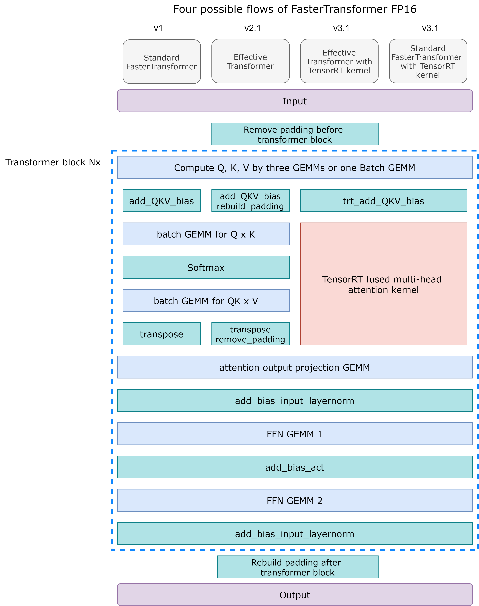
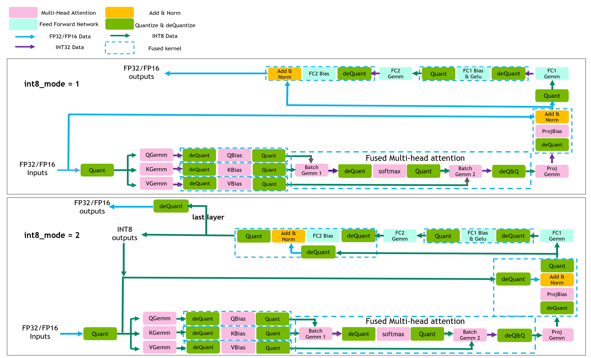

# FasterTransformer BERT

The FasterTransformer BERT contains the optimized BERT model, Effective FasterTransformer and INT8 quantization inference. 

## Table Of Contents

- [FasterTransformer BERT](#fastertransformer-bert)
  - [Table Of Contents](#table-of-contents)
  - [Model architecture](#model-architecture)
    - [Standard BERT and Effective FasterTransformer](#standard-bert-and-effective-fastertransformer)
  - [Setup](#setup)
    - [Requirements](#requirements)
    - [Build the FasterTransformer](#build-the-fastertransformer)
      - [Prepare](#prepare)
      - [Build the project](#build-the-project)
  - [How to use](#how-to-use)
    - [BERT process](#bert-process)
  - [Performance](#performance)
    - [BERT performance](#bert-performance)
      - [BERT performance on A100 and TensorFlow](#bert-performance-on-a100-and-tensorflow)
      - [BERT performance on T4 and TensorFlow](#bert-performance-on-t4-and-tensorflow)
      - [BERT performance on V100 and TensorFlow](#bert-performance-on-v100-and-tensorflow)
      - [BERT performance comparison between T4, V100, A100 and A100 with MIG mode on TensorFlow](#bert-performance-comparison-between-t4-v100-a100-and-a100-with-mig-mode-on-tensorflow)
      - [BERT performance comparison between different features on T4 and TensorFlow](#bert-performance-comparison-between-different-features-on-t4-and-tensorflow)
      - [BERT performance on A100 and PyTorch](#bert-performance-on-a100-and-pytorch)
      - [BERT performance on T4 and PyTorch](#bert-performance-on-t4-and-pytorch)
      - [BERT performance on V100 and PyTorch](#bert-performance-on-v100-and-pytorch)
    - [Performance on BERT Applications: SQuAD MRPC](#performance-on-bert-applications-squad-mrpc)
      - [Performance of TensorFlow](#performance-of-tensorflow)
      - [Performance of PyTorch](#performance-of-pytorch)

## Model architecture

### Standard BERT and Effective FasterTransformer

The following configurations are supported in the FasterTransformer encoder. 
- Batch size (B<sub>1</sub>): smaller or equal to 4096
- Sequence length (S): smaller or equal to 4096. For INT8 mode=1, S should be a multiple of 32 when S > 384.
- Size per head (N): Even number and smaller than 128.
- Head number (H): Any number satisfying that H * N <= 1024 under FP32, or H * N <= 2048 under FP16.
- Data type: FP32, FP16 and INT8
- Any number layer (N<sub>1</sub>) if the memory is enough

In the FasterTransformer v1.0, we provide a highly optimized BERT-equivalent encoder model. Next, based on the idea of [Effective Transformer](https://github.com/bytedance/effective_transformer), we further optimize BERT inference by removing the useless padding in FasterTransformer v2.1 and provide the Effective FasterTransformer. In FasterTransformer v3.0, we provide INT8 quantization inference to get better performance. In FasterTransformer v3.1, we optimize the INT8 kernels to improve the performance of INT8 inference and integrate the multi-head attention of TensorRT plugin into FasterTransformer. In FasterTransformer v4.0, we add the multi-head attention kernel to support FP16 on V100 and INT8 on T4, A100. The following graph demonstrates the flow chart of these optimization, except INT8. In FasterTransformer v5.0, we refactor the codes, encapsulating the mask building and padding removing into the Bert forward function, and add the sparsity feature of Ampere GPU to accelerate the GEMM.
 
<div align=center></div>
<div align=center>Fig. 1 Flowchart of encoder.</div>

The BERT model is proposed by google in 2018. The encoder of FasterTransformer is equivalent to BERT model, but do lots of optimization. The leftmost flow of Fig. 1 shows the optimization in FasterTransformer. After optimization, FasterTransformer only uses 8 or 6 gemms (blue blocks) and 6 custom CUDA kernels (green blocks) to implement one transformer block.

For Effective FasterTransformer, the main idea is removing the padding of sentence to prevent computing the useless tokens. This method can save lots of time when the average sequence length of one batch is much smaller than the maximum sequence length. Fig. 2 shows the idea and the offset (in orange) we use. To implement the Effective FasterTransformer, we need to consider two problems. First, we need to remove the padding before BERT, and rebuild padding after leaving BERT to keep the shape of result. This is simple and only bring ignorable overhead. The second problem is the computing of multi-head attention. A naïve solution is rebuilding the padding before the multi-head attention and removing the padding after the multi-head attention, which demonstrate in the second flowchart of Fig. 1. Because we can fuse these rebuilding/removing into other kernels, the additional overheads are also ignorable.

To further improve the performance of multi head attention, we integrate the multi-head attention of TensorRT, which fuses the whole attention computing into one kernel. The source codes are [here]( https://github.com/NVIDIA/TensorRT/tree/master/plugin/bertQKVToContextPlugin). This kernel supports Effective FasterTransformer and standard BERT model at the same time. The third and forth flowcharts in Fig. 1 shows the workflow. With such kernel, we do not worry the padding issue multi-head attention. This kernel requires another offset, which is also show in Fig. 2.

<div align=center></div>
<div align=center>Fig. 2 Effective Transformer.</div>

Besides, we find that the padding would affect the accuracy for some tasks although they should be useless. So, we recommend removing the padding in the final outputs of downstream tasks. 

The arguments, inputs, and outputs of encoder: 

* Arguments:
  1. Maximum batch size
  2. Maximum sequence length
  3. Head number
  4. Size per head
  5. Intermediate size. The inter size of feed forward network. It is often set to 4 * head_num * size_per_head.
  6. Number of decoder layers
  7. SM version of GPU device. Some kernel chosen depend on the GPU device.
  8. Query scaling. It is used to scale the query before the batch multiplication of query and key.
  9. CUDA stream.
  10. Pointer of cuBLAS wrapper, which is declared in `src/fastertransformer/utils/cublasMMWrapper.h`.
  11. Pointer of memory allocator, which is declared in `src/fastertransformer/utils/allocator.h`
  12. “is_free_buffer_after_forward” flag. If setting to be true, FasterTransformer will allocate buffer before forward, and free buffer after forward. If the memory is controlled by memory pool and the cost of allocating/releasing memory is small, setting the flag to be true can save some memory.
  13. Attention type. There are four different types. Users can use `getAttentionType(size_per_head, sm, remove_padding, seq_len)` to determine the attention type automatically.
  14. The flag of sparsity. This feature requires Ampere GPU and a sparse model. If setting to true, then FT will use sparse gemm to accelerate the gemm computation.
  15. Activation type. There are two options, GeLU and ReLU now.
  16. LayerNorm type. There are two options, post layernorm and pre layernorm.
* Inputs:
  1. Bert input feature. This feature should be after the embedding lookup and position embedding. The shape is \[ request batch size, maximum sequence length, hidden dimension \].
  2. Sequence length. The shape is \[ request batch size \].
* Outputs:
  1. Bert output feature. The shape is \[ request batch size, maximum sequence length, hidden dimension \].

Besides, notice that the multi-head attention kernel from TensorRT is powerful but have some limitation. First, this kernel requires Turing or new GPU and the size per head must be 64. When the conditions are not satisfied, we use original multi-head attention implementation of FasterTransformer. Second, it requires an additional sequence length offset like fig 2 shows. More details are in [link](https://github.com/NVIDIA/TensorRT/tree/release/7.2/plugin/embLayerNormPlugin). When the input has padding, the shape of the sequence length offset is \[2 x B<sub>1</sub> + 1 \]. Assume there are three sentences with sequence length s<sub>1</sub>, s<sub>2</sub> and s<sub>3</sub>, and the sequence length after padding is S. Then the sequence length offset is \[0, s<sub>1</sub>, S, s<sub>2</sub> + S, 2 x S, 2 x S + s<sub>3</sub>, 3 x S\]. On the other hand, when we remove the padding, the shape of the sequence length offset is \[B<sub>1</sub> + 1\], and the sequence length offset is \[0, s<sub>1</sub>, s<sub>1</sub> + s<sub>2</sub>, s<sub>1</sub> + s<sub>2</sub> + s<sub>3</sub> \]. Namely, the sequence length offset records the sequence length for each sentence. When we have padding, we view the padding as some independent sentences. 

In FasterTransformer v4.0, we implement two pipelines of INT8 inference, as shown in Fig. 3.. For int8_mode == 1 (int8v1), we don't quantize residual connection, use int32 as the output of int8 gemms and use per-channel quantization for weights. For int8_mode == 2 (int8v2), we quantize residual connection, use int8 as the output of int8 gemms and use per-tensor quantization for weights. Generally speaking, int8_mode == 1 will have higher accuracy while int8_mode == 2 will have better performance.

<div align=center></div>
<div align=center>Fig. 3 Workflow of int8 inference.</div>

|               feature               | int8_mode == 1 | int8_mode == 2 |
| :---------------------------------: | :------------: | :------------: |
|          quantize residual          |       No       |      Yes       |
|          int8 output gemm           |       No       |      Yes       |
| per-channel quantiztion for weights |      Yes       |       No       |

For INT8 inference, quantized model is needed. We provide TensorFlow quantization tool and sample codes, and PyTorch sample codes with TensorRT's quantization tool is also provided. Please refer to the `README` in `bert-quantization/bert-tf-quantization` and `examples/pytorch/bert/bert-quantization-sparsity` first.

In FasterTransformer v5.0, we support the sparsity gemm to leverage the sparsity feature of Ampere GPU. We also provide an example on PyTorch.

## Setup

The following section lists the requirements to use FasterTransformer BERT.

### Requirements

- CMake >= 3.8 for Tensorflow, CMake >= 3.13 for PyTorch
- CUDA 11.0 or newer version
- Python 3 is recommended because some features are not supported in python 2
- Tensorflow: Verify on 1.15, 1.13 and 1.14 should work.
- PyTorch: Verify on 1.8.0, >= 1.5.0 should work.

These components are readily available within the NGC TensorFlow/PyTorch Docker image below.

Ensure you have the following components:
- [NVIDIA Docker](https://github.com/NVIDIA/nvidia-docker) and NGC container are recommended
- [NVIDIA Pascal](https://www.nvidia.com/en-us/data-center/pascal-gpu-architecture/) or [Volta](https://www.nvidia.com/en-us/data-center/volta-gpu-architecture/) or [Turing](https://www.nvidia.com/en-us/geforce/turing/) or [Ampere](https://www.nvidia.com/en-us/data-center/nvidia-ampere-gpu-architecture/) based GPU 

For more information about how to get started with NGC containers, see the following sections from the NVIDIA GPU Cloud Documentation and the Deep Learning Documentation:

- [Getting Started Using NVIDIA GPU Cloud](https://docs.nvidia.com/ngc/ngc-getting-started-guide/index.html)
- [Accessing And Pulling From The NGC Container Registry](https://docs.nvidia.com/deeplearning/frameworks/user-guide/index.html#accessing_registry)
- [Running TensorFlow](https://docs.nvidia.com/deeplearning/frameworks/tensorflow-release-notes/running.html#running)
- [Running PyTorch](https://docs.nvidia.com/deeplearning/frameworks/pytorch-release-notes/index.html)

For those unable to use the NGC container, to set up the required environment or create your own container, see the versioned [NVIDIA Container Support Matrix](https://docs.nvidia.com/deeplearning/frameworks/support-matrix/index.html).

### Build the FasterTransformer

#### Prepare

    You can choose the tensorflow version and python version you want. Here, we list some possible images:

    - `nvcr.io/nvidia/tensorflow:19.07-py2` contains the TensorFlow 1.14 and python 2.7. 
    - `nvcr.io/nvidia/tensorflow:20.12-tf1-py3` contains the TensorFlow 1.15 and python 3.8. 
    - `nvcr.io/nvidia/pytorch:20.03-py3` contains the PyTorch 1.5.0 and python 3.6
    - `nvcr.io/nvidia/pytorch:20.07-py3` contains the PyTorch 1.6.0 and python 3.6
    - `nvcr.io/nvidia/pytorch:20.12-py3` contains the PyTorch 1.8.0 and python 3.8

    To achieve best performance, we recommend to use the latest image. For example, running image `nvcr.io/nvidia/tensorflow:20.12-tf1-py3` by 

    ```bash
    nvidia-docker run -ti --rm nvcr.io/nvidia/tensorflow:20.12-tf1-py3 bash
    git clone https://github.com/NVIDIA/FasterTransformer.git
    mkdir -p FasterTransformer/build
    cd FasterTransformer/build
    git submodule init && git submodule update
    ```

#### Build the project

* Note: the `xx` of `-DSM=xx` in following scripts means the compute capability of your GPU. For example, 60 (P40) or 61 (P4) or 70 (V100) or 75(T4) or 80 (A100).  Default setting is including 70, 75, 80 and 86.

1. build with C++

    ```bash
    cmake -DSM=xx -DCMAKE_BUILD_TYPE=Release ..
    make
    ```

2. build with TensorFlow 

    Uses need to set the path of TensorFlow. For example, if we use `nvcr.io/nvidia/tensorflow:20.12-tf1-py3`, then

    ```bash
    cmake -DSM=xx -DCMAKE_BUILD_TYPE=Release -DBUILD_TF=ON -DTF_PATH=/usr/local/lib/python3.8/dist-packages/tensorflow_core/ ..
    make 
    ```

3. build with PyTorch

    ```bash
    cmake -DSM=xx -DCMAKE_BUILD_TYPE=Release -DBUILD_PYT=ON ..
    make
    ```

    This will build the TorchScript custom class. Please make sure that the `PyTorch >= 1.5.0`.

    If user want to use sparsity gemm on BERT, then you need to download and extract the cusparseLt library and build with `-DSPARSITY_SUPPORT=ON -DCUSPARSELT_PATH=/the_extracted_cusparselt_path`:

    ```bash
    wget https://developer.download.nvidia.com/compute/libcusparse-lt/0.1.0/local_installers/libcusparse_lt-linux-x86_64-0.1.0.2.tar.gz
    tar -xzvf libcusparse_lt-linux-x86_64-0.1.0.2.tar.gz
    cmake -DSM=xx -DCMAKE_BUILD_TYPE=Release -DBUILD_PYT=ON -DSPARSITY_SUPPORT=ON -DCUSPARSELT_PATH=/the_extracted_cusparselt_path ..
    make
    ```

## How to use

### BERT process

1. Run FasterTransformer BERT on C++

    1.1 Generate the `gemm_config.in` file for FP32/FP16 and the `igemm_config.in` file for INT8

    There are two methods to generate the best GEMM configuration
    
    1.1.1 Using `./bin/bert_gemm` to generate the best GEMM configuration.  

    ```bash
    ./bin/bert_gemm <batch_size> <sequence_length> <head_number> <size_per_head> <is_use_fp16> <int8_mode>
    ```

    1.1.2 Generate the best GEMM configuration when running BERT.

    When <allow_gemm_test> == 1, it will first check if the corresponding GEMM configuration exists, if not, it will automatically generate the best GEMM configuration.

    ```bash
    ./bin/bert_example <batch_size> <num_layers> <sequence_length> <head_number> <size_per_head> <is_use_fp16> <is_remove_padding> <int8_mode> <allow_gemm_test>
    ```

    The generation of best GEMM configuration is recommended no matter what platform we use when we use FasterTransformer. If we do not generate the configure file, the FasterTransformer will use the default configuration and the inference speed may be slower. 

    Assume the settings of the BERT are as follows:

    - `batch_size`=32
    - `sequence_length`=32
    - `head_number`=12
    - `size_per_head`=64 
    - `data_type`=0 (FP32) or 1 (FP16) or 2 (BF16)
    - `int8_mode`=0

    Then the following scripts can generate the best GEMM configuration under such settings and record the configuration into the `gemm_config.in` file.

    ```bash
    ## Method 1
    ./bin/bert_gemm 32 32 12 64 0 0
    ``` 

    In the following subsection, we use the same settings and 12 transformer layers unless specified. 

    1.2 Run FasterTransformer BERT under FP32 on C++

    `./bin/bert_example` runs the BERT in the `C++`. The arguments of `bert_example` is:

    ```bash
    ./bin/bert_example <batch_size> <num_layers> <sequence_length> <head_number> <size_per_head> <is_use_fp16> <is_remove_padding> <int8_mode>
    ```

    Then the following scripts can run the BERT under the above settings. 

    ```bash
    ./bin/bert_example 32 12 32 12 64 0 0
    ```

    The outputs should be like to the following:  

    ```bash
    Device Tesla V100-PCIE-32GB
    before allocate free 29.46 GB total 31.75 GB
    After allocate free 29.41 GB used 2.34 GB total 31.75 GB
    [INFO] batch_size 32 seq_len 32 layer 12 FT-CPP-time 16.51 ms (100 iterations)
    ```

    1.3 Run FasterTransformer BERT under FP16 on C++

    So far, we use the FP32 to run the FasterTransformer. If we use the volta or newer NVIDIA GPU, we can use tensor core when we use the FP16. 

    To use the FP16, we only need to set the `<is_use_fp16>` flag to 1 like following:

    ```bash
    ./bin/bert_gemm 32 32 12 64 1 0
    ./bin/bert_example 32 12 32 12 64 1 0 0 
    ```

    Note that the configuration of FP32 and FP16 are different, so we need to generate the configuration again. 

    The outputs should be like to the following:  

    ```bash
    Device Tesla V100-PCIE-32GB
    before allocate free 29.46 GB total 31.75 GB
    After allocate free 29.43 GB used 2.32 GB total 31.75 GB
    [INFO] batch_size 32 seq_len 32 layer 12 FT-CPP-time 4.00 ms 
    ```
    
    1.4 Run FasterTransformer BERT under INT8 on C++

    If we use the Turing or newer NVIDIA GPUs, we can use tensor core when we use the INT8.    

    To use the INT8, we only need to set the `<int8_mode>` flag to 1 or 2 like following:

    ```bash
    #For int8_mode == 1
    ./bin/bert_gemm 32 32 12 64 1 1
    ./bin/bert_int8_example 32 12 32 12 64 1 0 1
    
    #For int8_mode == 2
    ./bin/bert_gemm 32 32 12 64 1 2
    ./bin/bert_int8_example 32 12 32 12 64 1 0 2
    ```

    Note that the configuration file of FP32/FP16 and INT8 are different, so we need to generate the configuration again. And the <is_use_fp16> is not necessarily 1, depending on what data type bias is.

    The outputs should be like to the following:  

    ```bash
    #For int8_mode == 1
    Device Tesla T4
    Device Tesla T4
    before allocate free 14.64 GB total 14.76 GB
    After allocate free 14.62 GB used 0.13 GB total 14.76 GB
    [INFO] batch_size 32 seq_len 32 layer 12 FT-CPP-time 7.49 ms ( 50 iterations) 
    
    #For int8_mode == 2
    Device Tesla T4
    Device Tesla T4
    before allocate free 14.64 GB total 14.76 GB
    After allocate free 14.62 GB used 0.13 GB total 14.76 GB
    [INFO] batch_size 32 seq_len 32 layer 12 FT-CPP-time 4.79 ms ( 50 iterations)
    ```

    1.5 Run Effective FasterTransformer under FP32 on C++

    To use the Effective FasterTransformer, we only need to set the `<is_remove_padding>` flag to 1 like following:

    ```bash
    ./bin/bert_gemm 32 32 12 64 0 0
    ./bin/bert_example 32 12 32 12 64 0 1 0
    ```

    The outputs should be like to the following:  

    ```bash 
    Device Tesla V100-PCIE-32GB
    before allocate free 29.46 GB total 31.75 GB
    After allocate free 29.40 GB used 2.35 GB total 31.75 GB
    [INFO] batch_size 32 seq_len 32 layer 12 FT-CPP-time 9.77 ms 
    ```
    
    1.6 Run Effective FasterTransformer under INT8 on C++
    
    To use the Effective FasterTransformer under INT8, we need to set the `<is_remove_padding>` flag to 1 and `<int8_mode>` flag to 1 or 2 like following. Since the sequence length in INT8 should be a multiple of 32, Effective FasterTransformer could be a good choice for INT8.
    
    ```bash
    #For int8_mode == 1
    ./bin/bert_gemm 32 32 12 64 1 1
    ./bin/bert_int8_example 32 12 32 12 64 1 1 1
    
    #For int8_mode == 2
    ./bin/bert_gemm 32 32 12 64 1 2
    ./bin/bert_int8_example 32 12 32 12 64 1 1 2
    ```
    
    The outputs should be like to the following:
    
    ```bash 
    #For int8_mode == 1
    Device Tesla T4
    Device Tesla T4
    before allocate free 14.64 GB total 14.76 GB
    After allocate free 14.62 GB used 0.14 GB total 14.76 GB
    [INFO] batch_size 32 seq_len 32 layer 12 FT-CPP-time 4.06 ms ( 50 iterations)

    
    #For int8_mode == 2
    Device Tesla T4
    Device Tesla T4
    before allocate free 14.64 GB total 14.76 GB
    After allocate free 14.62 GB used 0.14 GB total 14.76 GB
    [INFO] batch_size 32 seq_len 32 layer 12 FT-CPP-time 2.69 ms ( 50 iterations)
    ```

2. Run FasterTransformer on TensorFlow (on T4 GPU)

    2.1 Run FasterTransformer encoder under FP32 on TensorFlow

    ```bash
    ./bin/bert_gemm 32 32 12 64 0 0
    python ../examples/tensorflow/bert/bert_example.py \
            --batch_size 32 \
            --max_seq_len 32 \
            --head_number 12 \
            --size_per_head 64 \
            --num_layer 12 \
            --data_type fp32 \
            --test_time 1
    ```

    The outputs should be like to the following:  

    ```bash
    [INFO] Encoder TF v.s. FT with tensor input Cross check True
    [INFO] Max diff 5.4836273193359375e-06
    [INFO] min diff 0.0
    [INFO] Encoder TF v.s. EFF-FT with tensor input Cross check True
    [INFO] Max diff 4.76837158203125e-06
    [INFO] min diff 0.0
    [INFO] batch_size 32 max_seq_len 32 precision FP32 12 layer TF-while-time      44.49 ms ( 50 iterations)
    [INFO] batch_size 32 max_seq_len 32 precision FP32 12 layer FT-OP-while-time   44.30 ms ( 50 iterations)
    [INFO] batch_size 32 max_seq_len 32 precision FP32 12 layer EFF-OP-while-time  22.83 ms ( 50 iterations)
    ```

    Note: We can also generate the best GEMM configuration when running encoder by setting `--allow_gemm_test True`.
    Note: If users use Ampere GPUs, then TensorFlow will uses TF32 by default, and hence TensorFlow will be faster than FasterTransformer, and have large value differences.

    2.2 Run FasterTransformer BERT under FP16 on TensorFlow

    To use the FP16 in TensorFlow, we only need to set the `--data_type fp16` like following:

    ```bash
    ./bin/bert_gemm 32 32 12 64 1 0
    python ../examples/tensorflow/bert/bert_example.py \
            --batch_size 32 \
            --max_seq_len 32 \
            --head_number 12 \
            --size_per_head 64 \
            --num_layer 12 \
            --data_type fp16 \
            --test_time 1
    ```

    The outputs should be like to the following:  

    ```bash
    [INFO] Encoder TF v.s. FT with tensor input Cross check True
    [INFO] Max diff 0.0234375
    [INFO] min diff 0.0
    [INFO] Encoder TF v.s. EFF-FT with tensor input Cross check False
    [INFO] Max diff 0.033203125
    [INFO] min diff 0.0
    [INFO] batch_size 32 max_seq_len 32 precision FP16 12 layer TF-while-time      12.27 ms ( 50 iterations)
    [INFO] batch_size 32 max_seq_len 32 precision FP16 12 layer FT-OP-while-time    8.59 ms ( 50 iterations)
    [INFO] batch_size 32 max_seq_len 32 precision FP16 12 layer EFF-OP-while-time   4.98 ms ( 50 iterations)
    ```

    2.3 Run FasterTransformer and Effective FasterTransformer encoder under INT8 on TensorFlow

    To use the INT8 in TensorFlow, we only need to set the `--int8_mode 1` or `--int8_mode 2` like following:

    ```bash
    #For int8_mode == 1
    ./bin/bert_gemm 32 32 12 64 1 1
    python ../examples/tensorflow/bert/bert_example.py \
            --batch_size 32 \
            --max_seq_len 32 \
            --head_number 12 \
            --size_per_head 64 \
            --num_layer 12 \
            --data_type fp16 \
            --test_time 1 \
            --int8_mode 1
            
    #For int8_mode == 2
    ./bin/bert_gemm 32 32 12 64 1 2
    python ../examples/tensorflow/bert/bert_example.py \
            --batch_size 32 \
            --max_seq_len 32 \
            --head_number 12 \
            --size_per_head 64 \
            --num_layer 12 \
            --data_type fp16 \
            --test_time 1 \
            --int8_mode 2
    ```

    The outputs should be like to the following:  

    ```bash
    #For int8_mode == 1
    [INFO] Encoder TF v.s. FT with tensor input Cross check False
    [INFO] Max diff 4.19140625
    [INFO] min diff 0.0
    [INFO] Encoder TF v.s. EFF-FT with tensor input Cross check False
    [INFO] Max diff 4.19140625
    [INFO] min diff 0.0
    [INFO] batch_size 32 max_seq_len 32 precision FP16 12 layer TF-while-time      12.64 ms ( 50 iterations)
    [INFO] batch_size 32 max_seq_len 32 precision INT8-v1 12 layer FT-OP-while-time    7.68 ms ( 50 iterations)
    [INFO] batch_size 32 max_seq_len 32 precision INT8-v1 12 layer EFF-OP-while-time   4.34 ms ( 50 iterations)
    
    #For int8_mode == 2
    [INFO] Encoder TF v.s. FT with tensor input Cross check False
    [INFO] Max diff 6.06640625
    [INFO] min diff 0.0
    [INFO] Encoder TF v.s. EFF-FT with tensor input Cross check False
    [INFO] Max diff 6.06640625
    [INFO] min diff 0.0
    [INFO] batch_size 32 max_seq_len 32 precision FP16 12 layer TF-while-time      12.47 ms ( 50 iterations)
    [INFO] batch_size 32 max_seq_len 32 precision INT8-v2 12 layer FT-OP-while-time    4.94 ms ( 50 iterations)
    [INFO] batch_size 32 max_seq_len 32 precision INT8-v2 12 layer EFF-OP-while-time   2.93 ms ( 50 iterations)
    ```
    
    Note: since we do not use the correct scales for quantization in this test, the Cross Check between TF and FT should fail.

    2.5 Run FasterTransformer for GLUE dataset

    This subsection demonstrates how to integrate the FasterTransformer in TensorFlow and evaluate the accuracy of FasterTransformer on GLUE dataset. To evaluate on GLUE dataset, it requires the repo of [BERT](https://github.com/google-research/bert).

    2.5.1 Prepare the BERT codes, Download the BERT pretrained model.

    ```bash
    git clone https://github.com/google-research/bert.git tensorflow/tensorflow_bert/bert
    wget https://storage.googleapis.com/bert_models/2018_10_18/uncased_L-12_H-768_A-12.zip
    unzip uncased_L-12_H-768_A-12.zip
    ```

    2.5.2 Download the GLUE MRPC dataset. Note that the file `download_glue_data.py` can only executed under python3. 

    ```bash
    wget https://gist.githubusercontent.com/W4ngatang/60c2bdb54d156a41194446737ce03e2e/raw/1502038877f6a88c225a34450793fbc3ea87eaba/download_glue_data.py
    python download_glue_data.py --tasks MRPC
    ```

    Note: If the `download_glue_data.py` has some issues, try to use [this](https://gist.github.com/vlasenkoalexey/fef1601580f269eca73bf26a198595f3).

    2.5.3 Finetune the pretrained model on MRPC datasets. This takes some minutes. 

    ```bash
    export BERT_BASE_DIR=${PWD}/uncased_L-12_H-768_A-12
    export GLUE_DIR=${PWD}/glue_data/

    python ../examples/tensorflow/bert/tensorflow_bert/bert/run_classifier.py \
          --task_name=MRPC \
          --do_train=true \
          --do_eval=true \
          --data_dir=$GLUE_DIR/MRPC \
          --vocab_file=$BERT_BASE_DIR/vocab.txt \
          --bert_config_file=$BERT_BASE_DIR/bert_config.json \
          --init_checkpoint=$BERT_BASE_DIR/bert_model.ckpt \
          --max_seq_length=128 \
          --train_batch_size=32 \
          --learning_rate=2e-5 \
          --num_train_epochs=3.0 \
          --output_dir=mrpc_output/
    ```

    The results would be like: 

    ```bash
    INFO:tensorflow:***** Eval results *****
    I1204 01:22:58.318809 139767509075776 run_classifier.py:923] ***** Eval results *****
    INFO:tensorflow:  eval_accuracy = 0.84068626
    I1204 01:22:58.318926 139767509075776 run_classifier.py:925]   eval_accuracy = 0.84068626
    INFO:tensorflow:  eval_loss = 0.5026195
    I1204 01:22:58.319309 139767509075776 run_classifier.py:925]   eval_loss = 0.5026195
    INFO:tensorflow:  global_step = 343
    I1204 01:22:58.319446 139767509075776 run_classifier.py:925]   global_step = 343
    INFO:tensorflow:  loss = 0.5026195
    I1204 01:22:58.319561 139767509075776 run_classifier.py:925]   loss = 0.5026195

    ```

    2.5.4 Evaluate the accuracy of FasterTransformer under FP32

    To evaluate the accuracy of FasterTransformer, we can use `tensorflow/tensorflow_bert/run_classifier_wrap.py`. This file uses `run_classifier.py` of BERT repo, replacing the transformer model by FasterTransformer and add some additional arguments like `--floatx`. 

    ```bash 
    ./bin/bert_gemm 8 128 12 64 0 0
    python ../examples/tensorflow/bert/tensorflow_bert/run_classifier_wrap.py \
          --floatx=float32 \
          --task_name=MRPC \
          --do_eval=true \
          --data_dir=$GLUE_DIR/MRPC \
          --vocab_file=$BERT_BASE_DIR/vocab.txt \
          --bert_config_file=$BERT_BASE_DIR/bert_config.json \
          --init_checkpoint=mrpc_output/model.ckpt-343 \
          --max_seq_length=128 \
          --eval_batch_size=8 \
          --output_dir=mrpc_output
    ```

    The results would be like: 

    ```bash
    INFO:tensorflow:***** Eval results *****
    I1204 01:25:59.202495 140314814412608 run_classifier.py:923] ***** Eval results *****
    INFO:tensorflow:  eval_accuracy = 0.84068626
    I1204 01:25:59.202617 140314814412608 run_classifier.py:925]   eval_accuracy = 0.84068626
    INFO:tensorflow:  eval_loss = 0.50261945
    I1204 01:25:59.202857 140314814412608 run_classifier.py:925]   eval_loss = 0.50261945
    INFO:tensorflow:  global_step = 343
    I1204 01:25:59.202969 140314814412608 run_classifier.py:925]   global_step = 343
    INFO:tensorflow:  loss = 0.50261945
    I1204 01:25:59.203072 140314814412608 run_classifier.py:925]   loss = 0.50261945
    ```

    2.5.5 Convert the finetuned checkpoint to FP16 and evaluate the accuracy of FasterTransformer under FP16. 

    To convert the checkpoint from FP32 to FP16, we can use `../examples/tensorflow/bert/tensorflow_bert/ckpt_type_convert.py` to convert the checkpoint. This file requires two arguments, the location of FP32 checkpoint, and the location putting the FP16 checkpoint.

    ```bash
    python ../examples/tensorflow/bert/tensorflow_bert/ckpt_type_convert.py \
          --init_checkpoint=mrpc_output/model.ckpt-343 \
          --fp16_checkpoint=mrpc_output_fp16/fp16_model.ckpt
    ./bin/bert_gemm 8 128 12 64 1 0
    python ../examples/tensorflow/bert/tensorflow_bert/run_classifier_wrap.py \
          --floatx=float16 \
          --task_name=MRPC \
          --do_eval=true \
          --data_dir=$GLUE_DIR/MRPC \
          --vocab_file=$BERT_BASE_DIR/vocab.txt \
          --bert_config_file=$BERT_BASE_DIR/bert_config.json \
          --init_checkpoint=mrpc_output_fp16/fp16_model.ckpt \
          --max_seq_length=128 \
          --eval_batch_size=8 \
          --output_dir=mrpc_output_fp16
    ```

    The results would be like: 

    ```bash
    INFO:tensorflow:***** Eval results *****
    I1204 01:27:49.961906 139736813242176 run_classifier.py:923] ***** Eval results *****
    INFO:tensorflow:  eval_accuracy = 0.8504902
    I1204 01:27:49.962020 139736813242176 run_classifier.py:925]   eval_accuracy = 0.8504902
    INFO:tensorflow:  eval_loss = 0.5103425
    I1204 01:27:49.962350 139736813242176 run_classifier.py:925]   eval_loss = 0.5103425
    INFO:tensorflow:  global_step = 343
    I1204 01:27:49.962482 139736813242176 run_classifier.py:925]   global_step = 343
    INFO:tensorflow:  loss = 0.5103358
    I1204 01:27:49.962604 139736813242176 run_classifier.py:925]   loss = 0.5103358
    ```

    2.5.6 Compare the speed of BERT of TensorFlow and FasterTransformer under both FP32 and FP16.

    To compare the speed of TensorFlow and FasterTransformer on BERT model directly, we can use `../examples/tensorflow/bert/tensorflow_bert/profile_transformer_inferece.py`. 

    ```bash
    ./bin/bert_gemm 8 128 12 64 0 0
    python ../examples/tensorflow/bert/tensorflow_bert/profile_transformer_inference.py \
            --init_checkpoint=mrpc_output/model.ckpt-343 \
            --tf_profile=false \
            --output_dir=mrpc_output \
            --profiling_output_file=time_elapsed \
            --xla=true \
            --floatx=float32
    ./bin/bert_gemm 8 128 12 64 1 0
    python ../examples/tensorflow/bert/tensorflow_bert/profile_transformer_inference.py \
            --init_checkpoint=mrpc_output_fp16/fp16_model.ckpt \
            --tf_profile=false \
            --output_dir=mrpc_output_fp16 \
            --profiling_output_file=time_elapsed \
            --xla=true \
            --floatx=float16
    ```

    The results of FP32 would be like:

    ```bash
    average time (seconds) elapsed original tensorflow: 0.049444806575775144 sec
    average time (seconds) elapsed fast transformer: 0.046385574340820315 sec
    ```

    The results of FP16 would be like:

    ```bash
    average time (seconds) elapsed original tensorflow: 0.015163004398345947 sec
    average time (seconds) elapsed fast transformer: 0.009342837333679199 sec
    ```

    2.7 Run FasterTransformer for SQuAD 1.1 dataset

    This subsection demonstrates how to integrate the FasterTransformer in TensorFlow and evaluates the accuracy of FasterTransformer on SQuAD 1.1 dataset. To evaluate on SQuAD 1.1 dataset, it requires the repo of [BERT](https://github.com/google-research/bert).

    2.7.1 Prepare the BERT codes and download the fine-tuned model of SQuAD 1.1 from NGC

    Because the training time of SQuAD is longer, and the NVIDIA NGC has provided the fine-tuned BERT model, we download the fine-tuned model directly.

    ```bash
    git clone https://github.com/google-research/bert.git tensorflow/tensorflow_bert/bert
    wget --content-disposition https://api.ngc.nvidia.com/v2/models/nvidia/bert_tf_ckpt_base_qa_squad11_amp_128/versions/19.03.1/zip -O bert_tf_ckpt_base_qa_squad11_amp_128_19.03.1.zip
    unzip bert_tf_ckpt_base_qa_squad11_amp_128_19.03.1.zip -d squad_model
    ```

    2.7.2 Download the SQuAD dataset. 

    ```bash
    mkdir squad_data
    wget -P squad_data https://rajpurkar.github.io/SQuAD-explorer/dataset/train-v1.1.json
    wget -P squad_data https://rajpurkar.github.io/SQuAD-explorer/dataset/dev-v1.1.json
    ```

    2.7.3 Evaluate the accuracy of TensorFlow under FP32

    ```bash
    python ../examples/tensorflow/bert/tensorflow_bert/bert/run_squad.py \
    --predict_batch_size=8 \
    --vocab_file=squad_model/vocab.txt \
    --bert_config_file=squad_model/bert_config.json \
    --init_checkpoint=squad_model/model.ckpt \
    --train_file=squad_data/train-v1.1.json \
    --do_predict=True \
    --predict_file=squad_data/dev-v1.1.json \
    --max_seq_length=384 \
    --output_dir=./squad_tf_output/fp_32/

    python ../examples/tensorflow/bert/tensorflow_bert/squad_evaluate_v1_1.py squad_data/dev-v1.1.json squad_tf_output/fp_32/predictions.json
    ```

    The results of TensorFlow would be like:

    ```bash
    {"exact_match": 78.9120151371807, "f1": 86.22012390507868}
    ```

    2.7.4 Evaluate the accuracy of FasterTransformer under FP32

    To evaluate the accuracy of FasterTransformer, we can use `../examples/tensorflow/bert/tensorflow_bert/run_squad_wrap.py`. This file uses `run_squad.py` of BERT repo, replacing the transformer model by FasterTransformer, and add some additional arguments like `--floatx`. 

    ```bash
    ./bin/bert_gemm 8 384 12 64 0 0
    python ../examples/tensorflow/bert/tensorflow_bert/run_squad_wrap.py \
          --floatx=float32 \
          --predict_batch_size=8 \
          --vocab_file=squad_model/vocab.txt \
          --bert_config_file=squad_model/bert_config.json \
          --init_checkpoint=squad_model/model.ckpt \
          --train_file=squad_data/train-v1.1.json \
          --do_predict=True \
          --predict_file=squad_data/dev-v1.1.json \
          --max_seq_length=384 \
          --output_dir=./squad_ft_output/fp_32/ \
          --allow_gemm_test=False

    python ../examples/tensorflow/bert/tensorflow_bert/squad_evaluate_v1_1.py squad_data/dev-v1.1.json squad_ft_output/fp_32/predictions.json
    ```

    The results of TensorFlow would be like:

    ```bash
    {"exact_match": 78.9120151371807, "f1": 86.22012390507868}
    ```

    2.7.5 Convert the checkpoint to FP16 and evaluate the accuracy of TensorFlow and FasterTransformer under FP16

    To convert the checkpoint from FP32 to FP16, we can use `tensorflow/tensorflow_bert/ckpt_type_convert.py` to convert the checkpoint. This file requires two arguments, the location of FP32 checkpoint, and the location putting the FP16 checkpoint.

    ```bash
    python ../examples/tensorflow/ckpt_type_convert.py --init_checkpoint=squad_model/model.ckpt --fp16_checkpoint=squad_fp16_model/model.ckpt

    ./bin/bert_gemm 8 384 12 64 1 0
    python ../examples/tensorflow/bert/tensorflow_bert/run_squad_wrap.py \
          --floatx=float16 \
          --predict_batch_size=8 \
          --vocab_file=squad_model/vocab.txt \
          --bert_config_file=squad_model/bert_config.json \
          --init_checkpoint=squad_fp16_model/model.ckpt \
          --train_file=squad_data/train-v1.1.json \
          --do_predict=True \
          --predict_file=squad_data/dev-v1.1.json \
          --max_seq_length=384 \
          --output_dir=./squad_ft_output/fp_16/ \
          --allow_gemm_test=False

    python ../examples/tensorflow/bert/tensorflow_bert/squad_evaluate_v1_1.py squad_data/dev-v1.1.json squad_ft_output/fp_16/predictions.json
    ```

    The results of TensorFlow would be like:

    ```bash
    {"exact_match": 79.03500473036897, "f1": 86.23027825772257}
    ```

      2.7.6 Evaluate the accuracy of Effective FasterTransformer under FP16
 
      Since the total sequence length is not fixed, we recommend using the default gemm configuration directly for Effective FasterTransformer.

      ```bash
      python ../examples/tensorflow/bert/tensorflow_bert/run_squad_wrap.py \
            --floatx=float16 \
            --predict_batch_size=8 \
            --vocab_file=squad_model/vocab.txt \
            --bert_config_file=squad_model/bert_config.json \
            --init_checkpoint=squad_fp16_model/model.ckpt \
            --train_file=squad_data/train-v1.1.json \
            --do_predict=True \
            --predict_file=squad_data/dev-v1.1.json \
            --max_seq_length=384 \
            --output_dir=./squad_ft_output/fp_16/ \
            --allow_gemm_test=False \
            --remove_padding=True

      python ../examples/tensorflow/bert/tensorflow_bert/squad_evaluate_v1_1.py squad_data/dev-v1.1.json squad_ft_output/fp_16/predictions.json
      ```

      The results of TensorFlow would be like:

      ```bash
      {"exact_match": 79.04446546830653, "f1": 86.23343183703513}
      ```

      2.7.7 Evaluate the accuracy of FasterTransformer under INT8

      Please refer to the directory `examples/tensorflow/bert/bert-quantization` first for how to get a quantized model. In `section 2.7.7` and `section 2.7.8`, to keep consistent with the procedures described in `examples/tensorflow/bert/bert-quantization`, we use `https://storage.googleapis.com/bert_models/2020_02_20/uncased_L-12_H-768_A-12.zip` as initial checkpoint with finetuned accuracy of <f1, exact_match> == <89.57, 82.44>. 
      
      In `bert-tf-quantization`, we give detailed procedure of Post Training Quantization (PTQ), Quantization Aware Training (QAT) and QAT with Knowledge-distillation. Since they have the same inference procedure, we use QAT-KD checkpoint to show how to evaluate the accuracy of FasterTransformer under INT8.  
      
      Suppose we already fine-tuned a FP32 checkpoint using QAT-KD with int8_mode == 2 as described in `bert-quantization`. The path to checkpoint is `squad_model/QAT_KD_mode_2/`.

      We first convert the checkpoint from FP32 to FP16 (this step is not necessary, but it will give us a better performance) and then quantize the FP16 checkpoint using `../examples/tensorflow/bert/tensorflow_bert/ckpt_quantization.py`. This file requires three arguments, the location of initial checkpoint, the location putting the quantized checkpoint and the int8_mode.
      
      ```bash
      python ../examples/tensorflow/bert/tensorflow_bert/ckpt_type_convert.py --init_checkpoint=squad_model/QAT_KD_mode_2/model.ckpt-27374 --fp16_checkpoint=squad_model/QAT_KD_mode_2_fp16/model.ckpt

      python ../examples/tensorflow/bert/tensorflow_bert/ckpt_quantization.py --init_checkpoint=squad_model/QAT_KD_mode_2_fp16/model.ckpt --quantized_checkpoint=squad_model/QAT_KD_mode_2_fp16_quantized/model.ckpt --int8_mode=2

      ./bin/bert_gemm 8 384 12 64 1 1
      python ../examples/tensorflow/bert/tensorflow_bert/run_squad_wrap.py \
            --floatx=float16 \
            --predict_batch_size=8 \
            --vocab_file=squad_model/vocab.txt \
            --bert_config_file=squad_model/bert_config.json \
            --init_checkpoint=squad_model/QAT_KD_mode_2_fp16_quantized/model.ckpt \
            --train_file=squad_data/train-v1.1.json \
            --do_predict=True \
            --predict_file=squad_data/dev-v1.1.json \
            --max_seq_length=384 \
            --output_dir=./squad_ft_output/int8_mode_2/ \
            --int8_mode=2 \
            --allow_gemm_test=False

      python ../examples/tensorflow/bert/tensorflow_bert/squad_evaluate_v1_1.py squad_data/dev-v1.1.json squad_ft_output/int8_mode_2/predictions.json
      ```
      
      The results of TensorFlow would be like:

      ```bash
      {"exact_match": 83.85052034058657, "f1": 90.46351799300075}
      ```
      
      2.7.8 Evaluate the accuracy of Effective FasterTransformer under INT8
      
      To evaluate the accuracy of Effective FasterTransformer under INT8, we follow the steps described in above section to get the correct checkpoint, and then run `../examples/tensorflow/bert/tensorflow_bert/run_squad_wrap.py` with `--remove_padding True` flag.
      
      ```bash
      ./bin/bert_gemm 8 384 12 64 1 1
      python ../examples/tensorflow/bert/tensorflow_bert/run_squad_wrap.py \
            --floatx=float16 \
            --predict_batch_size=8 \
            --vocab_file=squad_model/vocab.txt \
            --bert_config_file=squad_model/bert_config.json \
            --init_checkpoint=squad_model/QAT_KD_mode_2_fp16_quantized/model.ckpt \
            --train_file=squad_data/train-v1.1.json \
            --do_predict=True \
            --predict_file=squad_data/dev-v1.1.json \
            --max_seq_length=384 \
            --output_dir=./squad_ft_output/int8_mode_2_effectiveTransformer/ \
            --remove_padding=True \
            --int8_mode=2 \
            --allow_gemm_test=False

      python ../examples/tensorflow/bert/tensorflow_bert/squad_evaluate_v1_1.py squad_data/dev-v1.1.json squad_ft_output/int8_mode_2_effectiveTransformer/predictions.json
      ```
      
      The results of TensorFlow would be like:

      ```bash
      {"exact_match": 83.85052034058657, "f1": 90.46351799300075}
      ```

3. Run FasterTransformer on PyTorch

      Please install HuggingFace's `transformers` first before running the demos by
      ```bash
      pip install transformers==2.5.1
      ```

      3.1 Generate the `gemm_config.in` file:

      ```bash
      ./bin/bert_gemm <batch_size> <sequence_length> <head_number> <size_per_head> <is_use_fp16> <int8_mode>
      ./bin/bert_gemm 1 32 12 64 1 0
      ```
      If you want to use the library in other directory, please generate this file according to your setting and copy it to your working directory.

      3.2 Run the PyTorch BERT sample: 

      ```bash
      python ../examples/pytorch/bert/bert_example.py <batch_size> <layer_num> <sequence_length> <head_number> <size_per_head> <--fp16> <--int8_mode 0/1/2/3> <--sparse> <--time>
      python ../examples/pytorch/bert/bert_example.py 1 12 32 12 64 --fp16 --time
      ```
      
      Remove `--fp16` for fp32 mode. `--int8_mode 1` or `--int8_mode 2` or `--int8_mode 3` will use int8_mode 1 or 2 or 3 in FasterTransformer. `--sparse` will use Ampere sparsity feature if FasterTransformer is built with sparsity support.

      The outputs should be like to the following:

      ```bash
      FT Mean diff: 0.0004119873046875
      FT Max diff:  0.00830078125
      FT Min diff:  0.0
      EFF-FT Mean diff: 0.0004119873046875
      EFF-FT Max diff:  0.00830078125
      EFF-FT Min diff:  0.0
      [INFO] HuggingFaceEnocder time costs:    5.77 ms
      [INFO] FasterTransformer time costs:     1.12 ms
      [INFO] EFF-FasterTransformer time costs: 1.33 ms
      ```

      3.3 Run the BERT MRPC sample code:

      ```bash
      bash ../examples/pytorch/bert/scripts/run_mrpc.sh <model_type> <data_type>
      ```
      the `<mode_type>` can be:
      - `ori`: original HuggingFace's BERT encoder
      - `ths`: original HuggingFace's BERT encoder in TorchScript mode
      - `thsext`: our TorchScript custom class

      the `<data_type>` can be `fp32` or `fp16`

      For example, run HuggingFace's BERT under FP32 by following scripts:

      ```bash
      bash ../examples/pytorch/bert/scripts/run_mrpc.sh ori fp32
      ```

      The outputs should be like to the following:

      ```bash 
      06/28/2020 07:29:59 - INFO - __main__ -     Evaluation for mrpc done in total 4.646116 secs (0.011388 sec per example)
      06/28/2020 07:29:59 - INFO - __main__ -   ***** Eval results  *****
      06/28/2020 07:29:59 - INFO - __main__ -     acc = 0.8284313725490197
      06/28/2020 07:29:59 - INFO - __main__ -     acc_and_f1 = 0.8556872581808643
      06/28/2020 07:29:59 - INFO - __main__ -     f1 = 0.8829431438127091
      ```

      For example, run our PyTorch custom op under FP16 by following scripts:

      ```bash
      bash ../examples/pytorch/bert/scripts/run_mrpc.sh thsext fp16
      ```

      The outputs should be like to the following:

      ```bash 
      06/28/2020 07:30:19 - INFO - __main__ -     Evaluation for mrpc done in total 1.725153 secs (0.004228 sec per example)
      06/28/2020 07:30:19 - INFO - __main__ -   ***** Eval results  *****
      06/28/2020 07:30:19 - INFO - __main__ -     acc = 0.8284313725490197
      06/28/2020 07:30:19 - INFO - __main__ -     acc_and_f1 = 0.8556872581808643
      06/28/2020 07:30:19 - INFO - __main__ -     f1 = 0.8829431438127091
      ```

      3.4 Run the BERT SQuAD sample code:

      ```bash
      bash ../examples/pytorch/bert/scripts/run_squad.sh --mtype <model_type> --dtype <date_type> --path <model_path> --head_num <head_num> --head_size <head_size> --bs <batch_size> --seqlen <max_seq_len> --sparse <if_use_sparse> --remove_padding <if_remove_padding>
      ```
      - the `<mode_type>` can be:
          - `ori`: original HuggingFace's BERT encoder
          - `ths`: original HuggingFace's BERT encoder in TorchScript mode
          - `thsext`: our TorchScript custom class
      - the `<data_type>` can be `fp32` or `fp16` or `int8_1` or `int8_2` or `int8_3`
      - `<model_path>` is the directory containing the checkpoint
      - `<head_num>`, `<head_size>`, `<batch_size>`, and `<max_seq_len>` are the model and running parameters
      - `<if_use_sparse>` can be `true` or `false`
      - `<if_remove_padding>` can be `true` or `false`
      
      For example, run our PyTorch custom op under FP16 by following scripts (using HuggingFace's checkpoint):

      ```bash
      bash ../examples/pytorch/bert/scripts/run_squad.sh --mtype thsext --dtype fp16
      ```

      If we want to do INT8 or sparse tests, please refer to the directory `examples/pytorch/bert/bert-quantization-sparsity` first for how to get a trained model. After we obtained a model checkpoint, we can run it by specify the `<model_path>` and the related parameters. For example, run a BERT base model with INT8 mode 2 and sparse mode (need to do sparse training and QAT simultaneously for the checkpoint):
      ```bash
      bash ../examples/pytorch/bert/scripts/run_squad.sh \
            --mtype thsext \
            --dtype int8_2 \
            --path <the_trained_model_path> \
            --head_num 12 \
            -head_size 64 \
            --sparse true
      ```

## Performance

Hardware settings: 
* A100 (with mclk 1593MHz, pclk 1410MHz) with AMD EPYC 7742 64-Core Processor
* T4 (with mclk 5000MHz, pclk 1590MHz) with Intel(R) Xeon(R) CPU E5-2670 0 @ 2.60GHz
* V100 (with mclk 877MHz, pclk 1380MHz) with Intel(R) Xeon(R) CPU E5-2698 v4 @ 2.20GHz (dgx-1 server)

Note that the CPU may affect the performance when the batch size and sequence length are small. 

To run the following benchmark, we need to install the unix computing tool "bc" by

```bash
apt-get install bc
```

### BERT performance

We demonstrate the inference time of FasterTransformer in C++, TensorFlow and PyTorch, and compared to the performance on A100, T4 and V100.

For the benchmark of TensorFlow, we compare the performance of TensorFlow with XLA (TF), the performance of TensorFlow with FasterTransformer OP (FT) and the performance of TensorFlow with Effective FasterTransformer (EFF-FT), and show the speedup of FT and EFF-FT compared to the TensorFlow. Compared to v3.1, we modify the profiling method to hide the overhead of session run and memory copy. Thus, both TensorFlow and FasterTransformer are faster than v3.1 in TensorFlow benchmark on small batch size and sequence length. Because this new method has no obvious overhead compared to the FasterTransformer on C++, we skip the comparison with the C++ implementation.

For the benchmark of PyTorch, we compare the performance of TorchScript and the performance of PyTorch with FasterTransformer custom extension (CustomExt) and show the speedup of CustomExt compared to the TorchScript. For standard PyTorch implementation, we find that its performance is smaller or close to TorchScript, so we only demonstrate the performance of TorchScript. Besides, because CustomExt has no obvious overhead compared to the FasterTransformer on C++, we skip the comparison with the C++ implementation.

The FP32/FP16 results of C++ and TensorFlow were obtained by running the `benchmarks/bert/tf_benchmark.sh`.

The INT8 results of C++ and TensorFlow were obtained by running the `sample/tensorflow/scripts/profile_encoder_performance_int8.sh`.

The FP32/FP16 results of PyTorch were obtained by running the `sample/pytorch/scripts/profile_encoder.sh`. 

The FP32/FP16 results of PyTorch were obtained by running the `sample/pytorch/scripts/profile_encoder_int8.sh`. 

In the experiments of encoder, we updated the following parameters:

* head_num = 12
* size_per_head = 64 
* num_layers = 12

#### BERT performance on A100 and TensorFlow

* Performance on FP32

User can use `export NVIDIA_TF32_OVERRIDE=0` to enforce the program run under FP32.

| Batch_size | Seq_len | Precision | TF <br/> Latency (ms) | FT <br/> Latency (ms) | EFF-FT <br/> Latency (ms) | FT <br/> Speedup | EFF-FT <br/> Speedup |
| :--------: | :-----: | :-------: | :-------------------: | :-------------------: | :-----------------------: | :--------------: | :------------------: |
|     1      |   32    |   FP32    |         2.57          |         1.87          |           1.97            |       1.37       |         1.30         |
|     1      |   128   |   FP32    |         5.37          |         4.70          |           2.55            |       1.14       |         2.10         |
|     1      |   384   |   FP32    |         7.39          |         6.61          |           9.03            |       1.11       |         0.81         |
|     8      |   32    |   FP32    |         5.26          |         4.59          |           4.65            |       1.14       |         1.13         |
|     8      |   128   |   FP32    |         13.29         |         12.54         |           7.03            |       1.05       |         1.89         |
|     8      |   384   |   FP32    |         38.07         |         36.66         |           22.17           |       1.03       |         1.71         |
|     32     |   32    |   FP32    |         13.78         |         13.24         |           7.69            |       1.04       |         1.79         |
|     32     |   128   |   FP32    |         45.90         |         45.02         |           24.63           |       1.01       |         1.86         |
|     32     |   384   |   FP32    |        150.26         |        143.41         |           84.28           |       1.04       |         1.78         |

* Performance on TF32 (Note that the absolute differences of results under TF32 are larger than FP32.)

User can use `export NVIDIA_TF32_OVERRIDE=1` to enforce the program run under TF32.

| Batch_size | Seq_len | Precision | TF <br/> Latency (ms) | FT <br/> Latency (ms) | EFF-FT <br/> Latency (ms) | FT <br/> Speedup | EFF-FT <br/> Speedup |
| :--------: | :-----: | :-------: | :-------------------: | :-------------------: | :-----------------------: | :--------------: | :------------------: |
|     1      |   32    |   TF32    |         2.65          |         1.70          |           1.76            |       1.55       |         1.50         |
|     1      |   128   |   TF32    |         2.58          |         1.74          |           1.83            |       1.48       |         1.40         |
|     1      |   384   |   TF32    |         3.48          |         2.69          |           2.22            |       1.29       |         1.56         |
|     8      |   32    |   TF32    |         2.84          |         2.11          |           1.90            |       1.34       |         1.49         |
|     8      |   128   |   TF32    |         4.88          |         3.99          |           2.74            |       1.22       |         1.78         |
|     8      |   384   |   TF32    |         12.16         |         12.16         |           7.54            |       1.00       |         1.61         |
|     32     |   32    |   TF32    |         4.82          |         4.11          |           2.89            |       1.17       |         1.66         |
|     32     |   128   |   TF32    |         12.97         |         11.77         |           7.03            |       1.10       |         1.84         |
|     32     |   384   |   TF32    |         46.86         |         45.79         |           25.87           |       1.02       |         1.81         |

* Performance on FP16

| Batch_size | Seq_len | Precision | TF <br/> Latency (ms) | FT <br/> Latency (ms) | EFF-FT <br/> Latency (ms) | FT <br/> Speedup | EFF-FT <br/> Speedup |
| :--------: | :-----: | :-------: | :-------------------: | :-------------------: | :-----------------------: | :--------------: | :------------------: |
|     1      |   32    |   FP16    |         2.08          |         0.90          |           0.96            |       2.31       |         2.16         |
|     1      |   128   |   FP16    |         2.21          |         1.00          |           1.02            |       2.21       |         2.16         |
|     1      |   384   |   FP16    |         2.50          |         1.33          |           1.20            |       1.87       |         2.08         |
|     8      |   32    |   FP16    |         2.08          |         1.04          |           1.04            |       2.00       |         2.00         |
|     8      |   128   |   FP16    |         3.32          |         1.77          |           1.43            |       1.87       |         2.32         |
|     8      |   384   |   FP16    |         8.55          |         4.39          |           2.57            |       1.94       |         3.32         |
|     32     |   32    |   FP16    |         3.28          |         1.77          |           1.40            |       1.85       |         2.34         |
|     32     |   128   |   FP16    |         8.38          |         4.81          |           2.75            |       1.74       |         3.04         |
|     32     |   384   |   FP16    |         27.80         |         14.67         |           7.71            |       1.89       |         3.60         |

* Performance on INT8-v1

| Batch_size | Seq_len | TF-FP16 <br/> Latency (ms) | FT-INT8-v1 <br/> Latency (ms) | EFF-FT-INT8-v1 <br/> Latency (ms) | FT-INT8-v1 <br/> Speedup | EFF-FT-INT8-v1 <br/> Speedup |
| :--------: | :-----: | :------------------------: | :---------------------------: | :-------------------------------: | :----------------------: | :--------------------------: |
|     1      |   32    |            2.09            |             1.40              |               1.51                |           1.49           |             1.38             |
|     1      |   128   |            2.17            |             1.74              |               1.70                |           1.24           |             1.27             |
|     1      |   384   |            2.49            |             1.99              |               2.04                |           1.25           |             1.22             |
|     8      |   32    |            2.10            |             1.77              |               1.87                |           1.18           |             1.12             |
|     8      |   128   |            3.31            |             2.34              |               2.01                |           1.41           |             1.64             |
|     8      |   384   |            8.57            |             4.75              |               3.17                |           1.80           |             2.70             |
|     32     |   32    |            3.29            |             2.59              |               2.09                |           1.27           |             1.57             |
|     32     |   128   |            8.32            |             5.53              |               3.36                |           1.50           |             2.47             |
|     32     |   384   |           27.81            |             14.80             |               8.34                |           1.87           |             3.33             |

* Performance on INT8-v2

Note that the INT8-v2 leads to larger overhead because some optimization requires the weights of Q, K and V are continuous. Using c API or preprocess the model can bring better performance.

| Batch_size | Seq_len | TF-FP16 <br/> Latency (ms) | FT-INT8-v2 <br/> Latency (ms) | EFF-FT-INT8-v2 <br/> Latency (ms) | FT-INT8-v2 <br/> Speedup | EFF-FT-INT8-v2 <br/> Speedup |
| :--------: | :-----: | :------------------------: | :---------------------------: | :-------------------------------: | :----------------------: | :--------------------------: |
|     1      |   32    |            2.06            |             1.53              |               1.53                |           1.34           |             1.34             |
|     1      |   128   |            2.18            |             1.57              |               1.57                |           1.38           |             1.38             |
|     1      |   384   |            2.44            |             1.70              |               1.62                |           1.43           |             1.50             |
|     8      |   32    |            2.07            |             1.63              |               1.62                |           1.26           |             1.27             |
|     8      |   128   |            3.33            |             1.93              |               1.73                |           1.72           |             1.92             |
|     8      |   384   |            8.52            |             3.40              |               2.50                |           2.50           |             3.40             |
|     32     |   32    |            3.33            |             2.18              |               1.85                |           1.52           |             1.80             |
|     32     |   128   |            8.32            |             3.85              |               2.48                |           2.16           |             3.35             |
|     32     |   384   |           27.80            |             10.07             |               5.63                |           2.76           |             4.93             |

#### BERT performance on T4 and TensorFlow

* Performance on FP32

| Batch_size | Seq_len | Precision | TF <br/> Latency (ms) | FT <br/> Latency (ms) | EFF-FT <br/> Latency (ms) | FT <br/> Speedup | EFF-FT <br/> Speedup |
| :--------: | :-----: | :-------: | :-------------------: | :-------------------: | :-----------------------: | :--------------: | :------------------: |
|     1      |   32    |   FP32    |         3.63          |         2.51          |           2.96            |       1.44       |         1.22         |
|     1      |   128   |   FP32    |         7.10          |         6.11          |           4.78            |       1.16       |         1.48         |
|     1      |   384   |   FP32    |         19.69         |         19.01         |           11.16           |       1.03       |         1.76         |
|     8      |   32    |   FP32    |         12.85         |         11.44         |           6.75            |       1.12       |         1.90         |
|     8      |   128   |   FP32    |         49.19         |         42.88         |           23.48           |       1.14       |         2.09         |
|     8      |   384   |   FP32    |        154.09         |        140.36         |           84.84           |       1.09       |         1.81         |
|     32     |   32    |   FP32    |         45.37         |         41.66         |           22.33           |       1.08       |         2.03         |
|     32     |   128   |   FP32    |        183.49         |        162.62         |           93.41           |       1.12       |         1.96         |
|     32     |   384   |   FP32    |        602.69         |        552.46         |          331.55           |       1.09       |         1.81         |

* Performance on FP16

| Batch_size | Seq_len | Precision | TF <br/> Latency (ms) | FT <br/> Latency (ms) | EFF-FT <br/> Latency (ms) | FT <br/> Speedup | EFF-FT <br/> Speedup |
| :--------: | :-----: | :-------: | :-------------------: | :-------------------: | :-----------------------: | :--------------: | :------------------: |
|     1      |   32    |   FP16    |         5.84          |         1.92          |           2.33            |       3.04       |         2.50         |
|     1      |   128   |   FP16    |         3.30          |         2.57          |           2.47            |       1.28       |         1.33         |
|     1      |   384   |   FP16    |         5.91          |         3.85          |           3.34            |       1.53       |         1.76         |
|     8      |   32    |   FP16    |         4.48          |         2.69          |           2.76            |       1.66       |         1.62         |
|     8      |   128   |   FP16    |         12.34         |         8.31          |           4.89            |       1.48       |         2.52         |
|     8      |   384   |   FP16    |         39.88         |         24.37         |           12.47           |       1.63       |         3.19         |
|     32     |   32    |   FP16    |         12.21         |         8.40          |           4.89            |       1.45       |         2.49         |
|     32     |   128   |   FP16    |         45.50         |         32.32         |           17.04           |       1.40       |         2.67         |
|     32     |   384   |   FP16    |        159.93         |         97.66         |           48.60           |       1.63       |         3.29         |

* Performance on INT8-v1

| Batch_size | Seq_len | TF-FP16 <br/> Latency (ms) | FT-INT8-v1 <br/> Latency (ms) | EFF-FT-INT8-v1 <br/> Latency (ms) | FT-INT8-v1 <br/> Speedup | EFF-FT-INT8-v1 <br/> Speedup |
| :--------: | :-----: | :------------------------: | :---------------------------: | :-------------------------------: | :----------------------: | :--------------------------: |
|     1      |   32    |            4.44            |             1.98              |               2.50                |           2.24           |             1.77             |
|     1      |   128   |            3.48            |             2.93              |               3.03                |           1.18           |             1.14             |
|     1      |   384   |            5.94            |             3.68              |               3.24                |           1.61           |             1.83             |
|     8      |   32    |            4.51            |             2.71              |               3.04                |           1.66           |             1.48             |
|     8      |   128   |           12.10            |             6.63              |               3.93                |           1.82           |             3.07             |
|     8      |   384   |           39.64            |             18.10             |               9.68                |           2.19           |             4.09             |
|     32     |   32    |           12.30            |             7.54              |               4.39                |           1.63           |             2.80             |
|     32     |   128   |           45.26            |             22.97             |               12.45               |           1.97           |             3.63             |
|     32     |   384   |           173.49           |             68.89             |               39.49               |           2.51           |             4.39             |

* Performance on INT8-v2

| Batch_size | Seq_len | TF-FP16 <br/> Latency (ms) | FT-INT8-v2 <br/> Latency (ms) | EFF-FT-INT8-v2 <br/> Latency (ms) | FT-INT8-v2 <br/> Speedup | EFF-FT-INT8-v2 <br/> Speedup |
| :--------: | :-----: | :------------------------: | :---------------------------: | :-------------------------------: | :----------------------: | :--------------------------: |
|     1      |   32    |            4.57            |             3.03              |               2.96                |           1.50           |             1.54             |
|     1      |   128   |            3.75            |             2.41              |               2.20                |           1.55           |             1.70             |
|     1      |   384   |            5.88            |             2.90              |               3.17                |           2.02           |             1.85             |
|     8      |   32    |            4.10            |             2.87              |               2.91                |           1.42           |             1.40             |
|     8      |   128   |           12.27            |             5.13              |               3.38                |           2.39           |             3.63             |
|     8      |   384   |           39.50            |             13.47             |               7.14                |           2.93           |             5.53             |
|     32     |   32    |           12.09            |             5.90              |               3.51                |           2.04           |             3.44             |
|     32     |   128   |           45.23            |             17.19             |               9.09                |           2.63           |             4.97             |
|     32     |   384   |           158.10           |             52.41             |               28.65               |           3.01           |             5.51             |

#### BERT performance on V100 and TensorFlow

* Performance on FP32

| Batch_size | Seq_len | Precision | TF <br/> Latency (ms) | FT <br/> Latency (ms) | EFF-FT <br/> Latency (ms) | FT <br/> Speedup | EFF-FT <br/> Speedup |
| :--------: | :-----: | :-------: | :-------------------: | :-------------------: | :-----------------------: | :--------------: | :------------------: |
|     1      |   32    |   FP32    |         2.84          |         1.56          |           1.81            |       1.82       |         1.56         |
|     1      |   128   |   FP32    |         3.97          |         2.90          |           2.27            |       1.36       |         1.74         |
|     1      |   384   |   FP32    |         8.32          |         6.72          |           5.02            |       1.23       |         1.65         |
|     8      |   32    |   FP32    |         5.71          |         4.65          |           3.33            |       1.22       |         1.71         |
|     8      |   128   |   FP32    |         16.98         |         15.51         |           9.76            |       1.09       |         1.73         |
|     8      |   384   |   FP32    |         53.46         |         48.70         |           28.52           |       1.09       |         1.87         |
|     32     |   32    |   FP32    |         16.65         |         15.24         |           9.48            |       1.09       |         1.75         |
|     32     |   128   |   FP32    |         62.98         |         57.85         |           32.53           |       1.08       |         1.93         |
|     32     |   384   |   FP32    |        208.40         |        188.17         |          109.95           |       1.10       |         1.89         |

* Performance on FP16

| Batch_size | Seq_len | Precision | TF <br/> Latency (ms) | FT <br/> Latency (ms) | EFF-FT <br/> Latency (ms) | FT <br/> Speedup | EFF-FT <br/> Speedup |
| :--------: | :-----: | :-------: | :-------------------: | :-------------------: | :-----------------------: | :--------------: | :------------------: |
|     1      |   32    |   FP16    |         2.96          |         1.13          |           1.58            |       2.61       |         1.87         |
|     1      |   128   |   FP16    |         2.49          |         1.43          |           1.49            |       1.74       |         1.67         |
|     1      |   384   |   FP16    |         3.61          |         2.12          |           2.04            |       1.70       |         1.76         |
|     8      |   32    |   FP16    |         2.86          |         1.74          |           1.63            |       1.64       |         1.75         |
|     8      |   128   |   FP16    |         5.58          |         3.59          |           2.99            |       1.55       |         1.86         |
|     8      |   384   |   FP16    |         14.59         |         10.60         |           7.31            |       1.37       |         1.99         |
|     32     |   32    |   FP16    |         5.56          |         3.55          |           3.00            |       1.56       |         1.85         |
|     32     |   128   |   FP16    |         17.24         |         12.41         |           8.05            |       1.38       |         2.14         |
|     32     |   384   |   FP16    |         53.24         |         40.20         |           26.55           |       1.32       |         2.00         |

#### BERT performance comparison between T4, V100, A100 and A100 with MIG mode on TensorFlow

* Performance of EFF-FT on FP16

| Batch Size | Sequence <br/> Length" | Precision | T4 Latency | T4 <br/> Throughput | V100 Latency | V100 <br/> Throughput | A100 Latency | A100 <br/> Throughput | A100 MIG <br/> Latency | A100 MIG <br/> Throughput |
| :--------: | :--------------------: | :-------: | :--------: | :-----------------: | :----------: | :-------------------: | :----------: | :-------------------: | :--------------------: | :-----------------------: |
|     1      |           32           |   FP16    |    1.84    |         543         |     1.58     |          632          |     0.88     |         1136          |          1.42          |           4929            |
|     1      |          128           |   FP16    |    1.88    |         531         |     1.49     |          671          |     0.91     |         1098          |          1.54          |           4545            |
|     1      |          384           |   FP16    |    2.99    |         334         |     2.04     |          490          |     1.12     |          892          |          3.38          |           2071            |
|     8      |           32           |   FP16    |    2.1     |        3809         |     1.63     |         4907          |     0.96     |         8333          |           2            |           28000           |
|     8      |          128           |   FP16    |    4.93    |        1622         |     2.99     |         2675          |     1.38     |         5797          |          5.23          |           10707           |
|     8      |          384           |   FP16    |   13.47    |         593         |     7.31     |         1094          |     2.64     |         3030          |         13.87          |           4037            |
|     32     |           32           |   FP16    |    4.89    |        6543         |      3       |         10666         |     1.34     |         23880         |          5.26          |           42585           |
|     32     |          128           |   FP16    |   17.32    |        1847         |     8.05     |         3975          |     3.01     |         10631         |         16.41          |           13650           |
|     32     |          384           |   FP16    |   52.75    |         606         |    26.55     |         1205          |     8.98     |         3563          |          53.2          |           4210            |

* Performance of EFF-FT on INT8-v2

| Batch Size | Sequence <br/> Length" | Precision | T4 Latency | T4 <br/> Throughput | V100 Latency | V100 <br/> Throughput | A100 Latency | A100 <br/> Throughput | A100 MIG <br/> Latency | A100 MIG <br/> Throughput |
| :--------: | :--------------------: | :-------: | :--------: | :-----------------: | :----------: | :-------------------: | :----------: | :-------------------: | :--------------------: | :-----------------------: |
|     1      |           32           |  INT8-v2  |    1.87    |         534         |      x       |           x           |     1.19     |          840          |          1.35          |           5185            |
|     1      |          128           |  INT8-v2  |    1.88    |         531         |      x       |           x           |     1.2      |          833          |          1.46          |           4794            |
|     1      |          384           |  INT8-v2  |    2.4     |         416         |      x       |           x           |     1.31     |          763          |          2.23          |           3139            |
|     8      |           32           |  INT8-v2  |    2.37    |        3375         |      x       |           x           |     1.23     |         6504          |          1.87          |           29946           |
|     8      |          128           |  INT8-v2  |    3.07    |        2605         |      x       |           x           |     1.32     |         6060          |          3.43          |           16326           |
|     8      |          384           |  INT8-v2  |    7.42    |        1078         |      x       |           x           |     2.24     |         3571          |         10.94          |           5118            |
|     32     |           32           |  INT8-v2  |    3.41    |        9384         |      x       |           x           |     1.51     |         21192         |          4.26          |           52582           |
|     32     |          128           |  INT8-v2  |    9.53    |        3357         |      x       |           x           |     2.28     |         14035         |         11.57          |           19360           |
|     32     |          384           |  INT8-v2  |   30.53    |        1048         |      x       |           x           |     5.71     |         5604          |         37.03          |           6049            |

#### BERT performance comparison between different features on T4 and TensorFlow

| Batch Size | Sequence <br/> Length | FT-FP16 <br/> Latency | EFF-FT <br/> Latency | FT-INT8-v2 <br/> Latency | EFF-FT-INT8-v2 <br/> Latency | EFF-FT <br/> Speedup | FT-INT8-v2 <br/> Speedup | EFF-FT-INT8-v2 <br/> Speedup |
| :--------: | :-------------------: | :-------------------: | :------------------: | :----------------------: | :--------------------------: | :------------------: | :----------------------: | :--------------------------: |
|     1      |          32           |         1.58          |         1.84         |           2.06           |             1.87             |        0.859         |          0.767           |            0.845             |
|     1      |          128          |         1.96          |         1.88         |           2.19           |             1.88             |        1.043         |          0.895           |            1.043             |
|     1      |          384          |         3.71          |         2.99         |           2.68           |             2.4              |        1.241         |          1.384           |            1.546             |
|     8      |          32           |         2.62          |         2.1          |           2.61           |             2.37             |        1.248         |          1.004           |            1.105             |
|     8      |          128          |         8.37          |         4.93         |           5.19           |             3.07             |        1.698         |          1.613           |            2.726             |
|     8      |          384          |         25.87         |        13.47         |          14.54           |             7.42             |        1.921         |          1.779           |            3.487             |
|     32     |          32           |         8.43          |         4.89         |            6             |             3.41             |        1.724         |          1.405           |            2.472             |
|     32     |          128          |         34.13         |        17.32         |          17.91           |             9.53             |        1.971         |          1.906           |            3.581             |
|     32     |          384          |         99.72         |        52.75         |          55.39           |            30.53             |        1.890         |          1.800           |            3.266             |

#### BERT performance on A100 and PyTorch

* Performance on TF32

User can use `export NVIDIA_TF32_OVERRIDE=1` to enforce the program run under TF32.

| Batch_size | Seq_len | Precision | TorchScript <br/> Latency (ms) | FT <br/> Latency (ms) | EFF-FT <br/> Latency (ms) | FT <br/> Speedup | EFF-FT <br/> Speedup |
| :--------: | :-----: | :-------: | :----------------------------: | :-------------------: | :-----------------------: | :--------------: | :------------------: |
|     1      |   32    |   TF32    |              5.01              |         1.99          |           2.08            |       2.51       |         2.40         |
|     1      |   128   |   TF32    |              4.89              |         1.94          |           2.02            |       2.52       |         2.42         |
|     1      |   384   |   TF32    |              4.52              |         2.74          |           2.07            |       1.64       |         2.18         |
|     8      |   32    |   TF32    |              5.07              |         2.18          |           2.09            |       2.32       |         2.42         |
|     8      |   128   |   TF32    |              4.96              |         4.03          |           3.82            |       1.23       |         1.29         |
|     8      |   384   |   TF32    |             12.87              |         12.21         |           8.02            |       1.05       |         1.60         |
|     32     |   32    |   TF32    |              4.78              |         4.16          |           3.92            |       1.14       |         1.21         |
|     32     |   128   |   TF32    |             13.49              |         11.64         |           7.00            |       1.15       |         1.92         |
|     32     |   384   |   TF32    |             47.17              |         45.47         |           25.52           |       1.03       |         1.84         |

* Performance on FP16

| Batch_size | Seq_len | Precision | TorchScript <br/> Latency (ms) | FT <br/> Latency (ms) | EFF-FT <br/> Latency (ms) | FT <br/> Speedup | EFF-FT <br/> Speedup |
| :--------: | :-----: | :-------: | :----------------------------: | :-------------------: | :-----------------------: | :--------------: | :------------------: |
|     1      |   32    |   FP16    |              4.22              |         0.93          |           1.15            |       4.53       |         3.66         |
|     1      |   128   |   FP16    |              4.47              |         1.09          |           1.20            |       4.10       |         3.72         |
|     1      |   384   |   FP16    |              4.16              |         1.36          |           1.16            |       3.05       |         3.58         |
|     8      |   32    |   FP16    |              4.19              |         1.11          |           1.13            |       3.77       |         3.70         |
|     8      |   128   |   FP16    |              4.35              |         1.81          |           1.59            |       2.40       |         2.73         |
|     8      |   384   |   FP16    |              9.51              |         4.77          |           3.04            |       1.99       |         3.12         |
|     32     |   32    |   FP16    |              4.19              |         1.82          |           1.58            |       2.30       |         2.65         |
|     32     |   128   |   FP16    |              9.57              |         4.81          |           2.79            |       1.98       |         3.43         |
|     32     |   384   |   FP16    |             32.43              |         14.68         |           8.07            |       2.20       |         4.01         |

* Performance on FP16 sparsity

| <batch_size, seq_len> | FT Dense (ms) | FT Sparse (ms) | Dense EFF (ms) | Sparse EFF (ms) | FT Sparse Speedup | EFF Sparse Speedup |
| :-------------------: | :-----------: | :------------: | :------------: | :-------------: | :---------------: | :----------------: |
|        <1, 32>        |     0.80      |      0.86      |      1.30      |      1.61       |       0.93        |        0.81        |
|       <1, 128>        |     0.85      |      0.87      |      1.24      |      1.62       |       0.98        |        0.77        |
|       <1, 384>        |     1.18      |      1.18      |      1.22      |      1.68       |       1.00        |        0.73        |
|        <8, 32>        |     0.91      |      0.91      |      1.20      |      1.65       |       1.00        |        0.73        |
|       <8, 128>        |     1.66      |      1.58      |      1.59      |      1.86       |       1.05        |        0.85        |
|       <8, 384>        |     4.16      |      3.79      |      2.21      |      2.36       |       1.10        |        0.94        |
|       <32, 32>        |     1.68      |      1.58      |      1.42      |      1.77       |       1.06        |        0.80        |
|       <32, 128>       |     4.71      |      3.98      |      2.75      |      2.60       |       1.18        |        1.06        |
|       <32, 384>       |     14.79     |     12.20      |      7.90      |      7.72       |       1.21        |        1.02        |

* Performance on INT8-v1

| Batch_size | Seq_len | TorchScript-FP16 <br/> Latency (ms) | FT-INT8-v1 <br/> Latency (ms) | EFF-FT-INT8-v1 <br/> Latency (ms) | FT-INT8-v1 <br/> Speedup | EFF-FT-INT8-v1 <br/> Speedup |
| :--------: | :-----: | :---------------------------------: | :---------------------------: | :-------------------------------: | :----------------------: | :--------------------------: |
|     1      |   32    |                4.20                 |             1.44              |               1.56                |           2.91           |             2.69             |
|     1      |   128   |                4.30                 |             1.75              |               1.69                |           2.45           |             2.54             |
|     1      |   384   |                4.28                 |             1.98              |               1.76                |           2.16           |             2.43             |
|     8      |   32    |                4.18                 |             1.77              |               1.91                |           2.36           |             2.18             |
|     8      |   128   |                4.44                 |             2.28              |               1.76                |           1.94           |             2.52             |
|     8      |   384   |                9.50                 |             4.73              |               2.70                |           2.00           |             3.51             |
|     32     |   32    |                4.28                 |             2.51              |               2.10                |           1.70           |             2.03             |
|     32     |   128   |                9.59                 |             5.57              |               3.53                |           1.72           |             2.71             |
|     32     |   384   |                32.38                |             14.97             |               8.57                |           2.16           |             3.77             |

* Performance on INT8-v2

| Batch_size | Seq_len | TorchScript-FP16 <br/> Latency (ms) | FT-INT8-v2 <br/> Latency (ms) | EFF-FT-INT8-v2 <br/> Latency (ms) | FT-INT8-v2 <br/> Speedup | EFF-FT-INT8-v2 <br/> Speedup |
| :--------: | :-----: | :---------------------------------: | :---------------------------: | :-------------------------------: | :----------------------: | :--------------------------: |
|     1      |   32    |                4.35                 |             1.55              |               1.60                |           2.80           |             2.71             |
|     1      |   128   |                4.40                 |             1.59              |               1.62                |           2.76           |             2.71             |
|     1      |   384   |                4.27                 |             1.75              |               1.69                |           2.44           |             2.52             |
|     8      |   32    |                4.18                 |             1.67              |               1.64                |           2.50           |             2.54             |
|     8      |   128   |                4.24                 |             1.79              |               1.63                |           2.36           |             2.60             |
|     8      |   384   |                9.46                 |             3.45              |               2.37                |           2.74           |             3.99             |
|     32     |   32    |                4.21                 |             2.07              |               1.72                |           2.03           |             2.44             |
|     32     |   128   |                9.57                 |             3.88              |               2.45                |           2.46           |             3.90             |
|     32     |   384   |                32.37                |             10.39             |               6.08                |           3.11           |             5.32             |

* Performance on INT8-v2 sparsity

| <batch_size, seq_len> | FT Dense (ms) | FT Sparse (ms) | Dense EFF (ms) | Sparse EFF (ms) | FT Sparse Speedup | EFF Sparse Speedup |
| :-------------------: | :-----------: | :------------: | :------------: | :-------------: | :---------------: | :----------------: |
|        <1, 32>        |     0.80      |      0.86      |      1.30      |      1.61       |       0.84        |        0.83        |
|       <1, 128>        |     0.85      |      0.87      |      1.24      |      1.62       |       0.86        |        0.85        |
|       <1, 384>        |     1.18      |      1.18      |      1.22      |      1.68       |       0.95        |        0.86        |
|        <8, 32>        |     0.91      |      0.91      |      1.20      |      1.65       |       0.86        |        0.85        |
|       <8, 128>        |     1.66      |      1.58      |      1.59      |      1.86       |       1.05        |        0.99        |
|       <8, 384>        |     4.16      |      3.79      |      2.21      |      2.36       |       1.22        |        1.11        |
|       <32, 32>        |     1.68      |      1.58      |      1.42      |      1.77       |       1.04        |        0.91        |
|       <32, 128>       |     4.71      |      3.98      |      2.75      |      2.60       |       1.23        |        1.12        |
|       <32, 384>       |     14.79     |     12.20      |      7.90      |      7.72       |       1.17        |        1.07        |

#### BERT performance on T4 and PyTorch

* Performance on FP32

| Batch_size | Seq_len | Precision | TorchScript <br/> Latency (ms) | FT <br/> Latency (ms) | EFF-FT <br/> Latency (ms) | FT <br/> Speedup | EFF-FT <br/> Speedup |
| :--------: | :-----: | :-------: | :----------------------------: | :-------------------: | :-----------------------: | :--------------: | :------------------: |
|     1      |   32    |   FP32    |             11.51              |         2.65          |           4.35            |       4.34       |         2.64         |
|     1      |   128   |   FP32    |             11.45              |         6.23          |           4.60            |       1.83       |         2.48         |
|     1      |   384   |   FP32    |             22.09              |         18.81         |           11.24           |       1.17       |         1.96         |
|     8      |   32    |   FP32    |             13.82              |         11.31         |           6.75            |       1.22       |         2.04         |
|     8      |   128   |   FP32    |             53.91              |         43.51         |           21.87           |       1.23       |         2.46         |
|     8      |   384   |   FP32    |             180.82             |        144.51         |           87.56           |       1.25       |         2.06         |
|     32     |   32    |   FP32    |             52.66              |         42.34         |           25.22           |       1.24       |         2.08         |
|     32     |   128   |   FP32    |             203.04             |        168.30         |          109.82           |       1.20       |         1.84         |
|     32     |   384   |   FP32    |             707.27             |        587.40         |          373.25           |       1.20       |         1.89         |

* Performance on FP16

| Batch_size | Seq_len | Precision | TorchScript <br/> Latency (ms) | FT <br/> Latency (ms) | EFF-FT <br/> Latency (ms) | FT <br/> Speedup | EFF-FT <br/> Speedup |
| :--------: | :-----: | :-------: | :----------------------------: | :-------------------: | :-----------------------: | :--------------: | :------------------: |
|     1      |   32    |   FP16    |             11.04              |         1.72          |           3.56            |       6.41       |         3.10         |
|     1      |   128   |   FP16    |             10.51              |         2.05          |           3.90            |       5.12       |         2.69         |
|     1      |   384   |   FP16    |             10.37              |         3.78          |           3.73            |       2.74       |         2.78         |
|     8      |   32    |   FP16    |             10.94              |         2.67          |           4.20            |       4.09       |         2.60         |
|     8      |   128   |   FP16    |             13.41              |         8.55          |           4.71            |       1.56       |         2.84         |
|     8      |   384   |   FP16    |             46.82              |         26.03         |           16.88           |       1.79       |         2.77         |
|     32     |   32    |   FP16    |             13.02              |         8.51          |           5.32            |       1.52       |         2.44         |
|     32     |   128   |   FP16    |             54.28              |         33.38         |           15.71           |       1.62       |         3.45         |
|     32     |   384   |   FP16    |             192.80             |        103.63         |           51.00           |       1.86       |         3.78         |

* Performance on INT8-v1

| Batch_size | Seq_len | TorchScript-FP16 <br/> Latency (ms) | FT-INT8-v1 <br/> Latency (ms) | EFF-FT-INT8-v1 <br/> Latency (ms) | FT-INT8-v1 <br/> Speedup | EFF-FT-INT8-v1 <br/> Speedup |
| :--------: | :-----: | :---------------------------------: | :---------------------------: | :-------------------------------: | :----------------------: | :--------------------------: |
|     1      |   32    |                11.09                |             1.90              |               2.34                |           5.83           |             4.73             |
|     1      |   128   |                10.51                |             1.87              |               2.05                |           5.62           |             5.12             |
|     1      |   384   |                10.29                |             4.25              |               3.48                |           2.42           |             2.95             |
|     8      |   32    |                10.54                |             2.65              |               2.20                |           3.97           |             4.79             |
|     8      |   128   |                13.44                |             8.48              |               3.93                |           1.58           |             3.41             |
|     8      |   384   |                47.11                |             23.19             |               14.75               |           2.03           |             3.19             |
|     32     |   32    |                13.09                |             9.10              |               5.27                |           1.43           |             2.48             |
|     32     |   128   |                53.91                |             29.45             |               15.56               |           1.83           |             3.46             |
|     32     |   384   |               190.43                |             88.69             |               53.14               |           2.14           |             3.58             |

* Performance on INT8-v2

| Batch_size | Seq_len | TorchScript-FP16 <br/> Latency (ms) | FT-INT8-v2 <br/> Latency (ms) | EFF-FT-INT8-v2 <br/> Latency (ms) | FT-INT8-v2 <br/> Speedup | EFF-FT-INT8-v2 <br/> Speedup |
| :--------: | :-----: | :---------------------------------: | :---------------------------: | :-------------------------------: | :----------------------: | :--------------------------: |
|     1      |   32    |                10.96                |             1.98              |               1.99                |           5.53           |             5.50             |
|     1      |   128   |                10.52                |             2.04              |               1.95                |           5.15           |             5.39             |
|     1      |   384   |                10.49                |             2.81              |               2.71                |           3.73           |             3.87             |
|     8      |   32    |                10.49                |             2.61              |               2.10                |           4.01           |             4.99             |
|     8      |   128   |                13.46                |             5.45              |               3.22                |           2.46           |             4.18             |
|     8      |   384   |                47.14                |             15.19             |               9.37                |           3.10           |             5.03             |
|     32     |   32    |                13.00                |             6.10              |               3.46                |           2.13           |             3.75             |
|     32     |   128   |                53.09                |             18.90             |               10.73               |           2.80           |             4.94             |
|     32     |   384   |               186.43                |             59.04             |               35.05               |           3.15           |             5.31             |

#### BERT performance on V100 and PyTorch

* Performance on FP32

| Batch_size | Seq_len | Precision | TorchScript <br/> Latency (ms) | FT <br/> Latency (ms) | EFF-FT <br/> Latency (ms) | FT <br/> Speedup | EFF-FT <br/> Speedup |
| :--------: | :-----: | :-------: | :----------------------------: | :-------------------: | :-----------------------: | :--------------: | :------------------: |
|     1      |   32    |   FP32    |              6.91              |         1.75          |           1.99            |       3.94       |         3.47         |
|     1      |   128   |   FP32    |              7.84              |         3.23          |           2.20            |       2.42       |         3.56         |
|     1      |   384   |   FP32    |              9.46              |         7.40          |           7.66            |       1.27       |         1.23         |
|     8      |   32    |   FP32    |              8.78              |         5.09          |           4.79            |       1.72       |         1.83         |
|     8      |   128   |   FP32    |             20.86              |         16.65         |           11.43           |       1.25       |         1.82         |
|     8      |   384   |   FP32    |             61.20              |         52.38         |           37.15           |       1.16       |         1.64         |
|     32     |   32    |   FP32    |             20.29              |         16.41         |           9.68            |       1.23       |         2.09         |
|     32     |   128   |   FP32    |             70.65              |         62.44         |           36.18           |       1.13       |         1.95         |
|     32     |   384   |   FP32    |             232.66             |        209.90         |          119.96           |       1.10       |         1.93         |

* Performance on FP16

| Batch_size | Seq_len | Precision | TorchScript <br/> Latency (ms) | FT <br/> Latency (ms) | EFF-FT <br/> Latency (ms) | FT <br/> Speedup | EFF-FT <br/> Speedup |
| :--------: | :-----: | :-------: | :----------------------------: | :-------------------: | :-----------------------: | :--------------: | :------------------: |
|     1      |   32    |   FP16    |              6.66              |         1.31          |           1.81            |       5.08       |         3.67         |
|     1      |   128   |   FP16    |              6.99              |         1.59          |           1.81            |       4.39       |         3.86         |
|     1      |   384   |   FP16    |              7.16              |         2.37          |           2.05            |       3.02       |         3.49         |
|     8      |   32    |   FP16    |              7.18              |         1.99          |           1.84            |       3.60       |         3.90         |
|     8      |   128   |   FP16    |              6.83              |         3.97          |           3.48            |       1.72       |         1.96         |
|     8      |   384   |   FP16    |             17.51              |         11.47         |           7.44            |       1.52       |         2.35         |
|     32     |   32    |   FP16    |              8.99              |         3.93          |           3.43            |       2.28       |         2.62         |
|     32     |   128   |   FP16    |             20.20              |         13.53         |           9.29            |       1.49       |         2.17         |
|     32     |   384   |   FP16    |             65.62              |         44.13         |           27.92           |       1.48       |         2.35         |


### Performance on BERT Applications: SQuAD MRPC

#### Performance of TensorFlow

* [BERT-base-SQuAD-1.1 model]( For FP32/FP16, we use https://api.ngc.nvidia.com/v2/models/nvidia/bert_tf_ckpt_base_qa_squad11_amp_128/versions/19.03.1/zip; for INT8, we use https://storage.googleapis.com/bert_models/2020_02_20/uncased_L-12_H-768_A-12.zip, finetune it with FP32 precision and then use QAT-KD to generate INT8 checkpoint.), batch size 8, sequence length 128, on T4.

We use `tensorflow/tensorflow_bert/profile_transformer_inference.py` to generate the following results.

|                     Type                     | Exact match | F1 score | inference time (ms/example) |
| :------------------------------------------: | :---------: | :------: | :-------------------------: |
|               TensorFlow FP32                |   78.91%    |  86.22%  |            6.13             |
|          FasterTransformer OP FP32           |   78.91%    |  86.22%  |            5.76             |
|  FasterTransformer OP FP32 (remove padding)  |   78.91%    |  86.22%  |            2.75             |
|               TensorFlow FP16                |      x      |    x     |            1.77             |
|          FasterTransformer OP FP16           |   79.03%    |  86.23%  |            1.19             |
|  FasterTransformer OP FP16 (remove padding)  |   79.03%    |  86.23%  |            0.68             |
|                                              |             |          |
|                Finetune FP32                 |   78.81%    |  86.25%  |              x              |
|         FasterTransformer OP INT8v1          |   80.84%    |  87.69%  |            1.25             |
|         FasterTransformer OP INT8v2          |   80.70%    |  87.59%  |            0.83             |
| FasterTransformer OP INT8v1 (remove padding) |   80.84%    |  87.69%  |            0.77             |
| FasterTransformer OP INT8v2 (remove padding) |   80.70%    |  87.59%  |            0.62             |

#### Performance of PyTorch

* BERT-large-SQuAD-1.1, dev set: batch size 8, seq len 384, on T4

|                       Type                        | Exact match | F1 score | inference time (ms/example) |
| :-----------------------------------------------: | :---------: | :------: | :-------------------------: |
|                  TorchScipt FP32                  |   86.92%    |  93.15%  |            74.08            |
|             FasterTransformer OP FP32             |   86.93%    |  93.17%  |            60.66            |
|    FasterTransformer OP FP32 (remove padding)     |   86.93%    |  93.17%  |            33.97            |
|                  TorchScipt FP16                  |   86.93%    |  93.16%  |            20.17            |
|             FasterTransformer OP FP16             |   86.93%    |  93.15%  |            11.28            |
|    FasterTransformer OP FP16 (remove padding)     |   86.96%    |  93.16%  |            5.60             |
|                                                   |             |          |
|         FasterTransformer OP INT8 mode 2          |  87.50% *   | 93.48% * |            6.81             |
| FasterTransformer OP INT8 mode 2 (remove padding) |  87.50% *   | 93.48% * |            3.48             |

Note *: the checkpoint for INT8 is QAT-finetuned with knowledge-distillation by ourselves, and is different with others, so the accuracy is not comparable, the corresponding FP16 accuracy is `F1/EM: 92.89%/86.62%`.

* BERT-base-MRPC, dev set: batch size 8, seq len 128, on T4

|                    Type                    | Accuracy | F1 score | inference time (ms/example) |
| :----------------------------------------: | :------: | :------: | :-------------------------: |
|              TorchScipt FP32               |  82.84%  |  88.29%  |            6.97             |
|         FasterTransformer OP FP32          |  82.84%  |  88.29%  |            5.94             |
| FasterTransformer OP FP32 (remove padding) |  82.84%  |  88.29%  |            3.03             |
|              TorchScipt FP16               |  82.84%  |  88.29%  |            1.98             |
|         FasterTransformer OP FP16          |  82.84%  |  88.29%  |            1.20             |
| FasterTransformer OP FP16 (remove padding) |  82.84%  |  88.29%  |            0.70             |
