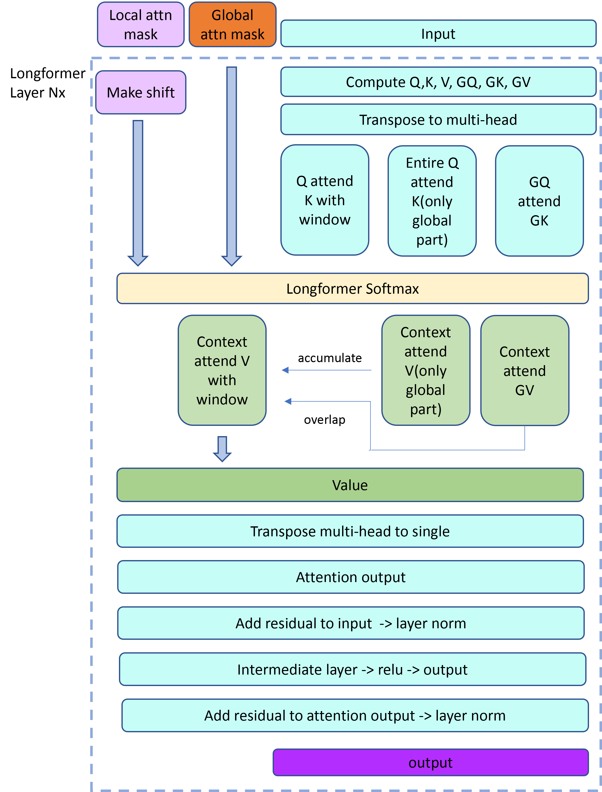

# FasterTransformer Longformer

The FasterTransformer Longformer contains the longformer model, which is a long-sequence capturing and processing deep learning model maintaining linear memory consumption and latency contrast to the standard transformer model. 

The Longformer model was presented in [Longformer: The Long-Document Transformer](https://arxiv.org/pdf/2004.05150.pdf). The abstract of the paper is the following:
>Transformer-based models are unable to process long sequences due to their self-attention operation, which scales quadratically with the sequence length. To address this limitation, we introduce the Longformer with an attention mechanism that scales linearly with sequence length, making it easy to process documents of thousands of tokens or longer. Longformer’s attention mechanism is a drop-in replacement for the standard self-attention and combines a local windowed attention with a task motivated global attention. Following prior work on long-sequence transformers, we evaluate Longformer on character-level language modeling and achieve state-of-the-art results on text8 and enwik8. In contrast to most prior work, we also pretrain Longformer and finetune it on a variety of downstream tasks. Our pretrained Longformer consistently outperforms RoBERTa on long document tasks and sets new state-of-the-art results on WikiHop and TriviaQA.

This FasterTransformer Longformer implementation is aligned with [Huggingface Longformer](https://huggingface.co/transformers/model_doc/longformer.html).

Currently in FasterTransformer, only the Encoder part of longformer is implemented. We had a `Question and Answering` sample to demonstrate the speed and correctness for the real use case. The `LongformerEncoder` is implemented in CUDA and CPP and wrapped with a pytorch op for user's smooth usage and integration.

## Notes

1. `seq_len` should `>= 2 * local_attn_window_size` and `seq_len % local_attn_window_size` = 0
2. `head_dim` only supports 64 right now.
3. `max_global_token_num` should `< local_attn_window_size`
4. In the input sequence, the `global_tokens` should be placed contiguously at the begginng.

## Table of Contents
- [FasterTransformer Longformer](#fastertransformer-longformer)
  - [Notes](#notes)
  - [Table of Contents](#table-of-contents)
  - [Longformer Encoder Computation Flow](#longformer-encoder-computation-flow)
  - [Demo](#demo)
    - [Requirements](#requirements)
    - [Setup](#setup)
    - [Run](#run)
      - [Args](#args)
  - [FasterTransformer Longformer Encoder Pytorch OP](#fastertransformer-longformer-encoder-pytorch-op)
    - [Usage](#usage)
      - [Building the FT Longformer encoder](#building-the-ft-longformer-encoder)
      - [Inference](#inference)
  - [Performance](#performance)
    - [FP32](#fp32)
    - [FP16](#fp16)

## Longformer Encoder Computation Flow

<div align=center></div>
<div align=center>Fig. 1 Flowchart of Longformer.</div>

## Demo

In this demo, you can run the longformer as a Pytorch OP.

### Requirements

- CMake >= 3.13 for PyTorch
- CUDA 11.0 or newer version
- Python 3 is recommended because some features are not supported in python 2
- PyTorch: Verify on 1.8.0, >= 1.5.0 should work.

These components are readily available within the NGC PyTorch Docker image below.

Ensure you have the following components:
- [NVIDIA Docker](https://github.com/NVIDIA/nvidia-docker) and NGC container are recommended
- [NVIDIA Pascal](https://www.nvidia.com/en-us/data-center/pascal-gpu-architecture/) or [Volta](https://www.nvidia.com/en-us/data-center/volta-gpu-architecture/) or [Turing](https://www.nvidia.com/en-us/geforce/turing/) or [Ampere](https://www.nvidia.com/en-us/data-center/nvidia-ampere-gpu-architecture/) based GPU

For more information about how to get started with NGC containers, see the following sections from the NVIDIA GPU Cloud Documentation and the Deep Learning Documentation:

- [Get Started Using NVIDIA GPU Cloud](https://docs.nvidia.com/ngc/ngc-getting-started-guide/index.html)
- [Access And Pull From The NGC Container Registry](https://docs.nvidia.com/deeplearning/frameworks/user-guide/index.html#accessing_registry)
- [Run PyTorch](https://docs.nvidia.com/deeplearning/frameworks/pytorch-release-notes/index.html)

For those unable to use the NGC container, to set up the required environment or create your own container, see the versioned [NVIDIA Container Support Matrix](https://docs.nvidia.com/deeplearning/frameworks/support-matrix/index.html).

### Setup

1. Start the docker container, ensure mounting the project directory into it. For example:
   ```bash
   docker run \
    -it \
    --rm \
    --ipc=host \
    --gpus=all \
    -v {YOUR_FASTER_TRANSFORMER_PROJECT_DIR_ON_HOST}:/workspace/FasterTransformer \
    --workdir /workspace/FasterTransformer \
    nvcr.io/nvidia/pytorch:21.02-py3 bash
   ```

   Here, we use `nvcr.io/nvidia/pytorch:21.02-py3`, you can also switch it to another CUDA-enabled Pytorch NGC containers, but need to comply with the previous requirements.

2. Install the HuggingFace Transformer code by `pip install transformers==4.9.2`
3. Build the FasterTransformer with pytorch:
   ```bash
   mkdir build && cd build
   cmake -DCMAKE_BUILD_TYPE=Release -DBUILD_PYT=ON ..
   make -j
   ```
4. Download the HuggingFace LongformerQA model by
   ```bash
   apt-get update && apt-get install git-lfs
   git lfs install
   git clone https://huggingface.co/allenai/longformer-large-4096-finetuned-triviaqa ../examples/pytorch/longformer/longformer-large-4096-finetuned-triviaqa
   ```

### Run

Run the python scripts with:

```
cd /workspace/FasterTransformer
python3 examples/pytorch/longformer/longformer_qa.py \
    --ft-longformer-lib build/lib/libth_longformer.so \
    --model-dir examples/pytorch/longformer/longformer-large-4096-finetuned-triviaqa \
    --passage "Jim Henson was a nice puppet" \
    --question "Who was Jim Henson?" \
    --repeat-test-num 50
```

The script will first compare the performance between HuggingFace Longformer encoder implementation of PyTorch and FasterTransformer's Longformer encoder implementation. Then it will print the answer.

#### Args

1. Use `--fp16` to run in FP16 mode, that's too say use FP16 input and yield FP16 output for FT longformer. Also HuggingFace's longformer will use FP16 too.
2. Use `--sequence-length` to select sequence length. `sequence_length` should >= 2 * `local_attention_window_size` and `sequence-length` % `local_attention_window_size` = 0
3. Use `-max-global-attention-num` to choose maximum of global token nums. That's too say your global token nums should not exceed this limit. And note that FT's longformer only support to place global tokens at the beginning of the sequence. In QA example, all the question tokens will be placed at the beginning of the sequence and marked as global tokens.
4. Use `--batch-size` to select batch size. Note in QA example, it will just duplicate the same question and passage sequence `batch_size` times and stack them together.
5. Use `--repeat-test-num` to select number of runs in inference comparison.

## FasterTransformer Longformer Encoder Pytorch OP

### Usage

#### Building the FT Longformer encoder
```python
# Pass the neccessary config and args
weights_file = os.path.join(hf_model_dir, 'pytorch_model.bin')
ft_encoder = FTLongformerEncoder(weights_file, layer_num, head_num, size_per_head,
                                 intermediate_size, local_attn_window_size,
                                 max_global_token_num, batch_size, seq_len,
                                 attn_scaler, ft_longformer_lib)

# You can directly substitute the original HuggingFace longformer encoder, if you
# want, for convenience
ft_longformer = build_hf_longformer(hf_model_dir)
ft_encoder.set_hf_plugin_mode(True)
ft_longformer.longformer.encoder = ft_encoder
```

#### Inference
```python
# You can either directly pass prepared input
ft_encoder.set_hf_plugin_mode(False)
output = ft_encoder.forward(input_b, local_attn_mask_b, global_attn_mask_b)
# local_attn_mask_b and global_attn_mask_b should have the same length as input. 1.0 stands for valid attention, 0.0
# stands for no attention

# Or directly use HuggingFace longformer as usual
outputs = ft_longformer(input_ids_b,
                        attention_mask=local_attn_mask_b,
                        global_attention_mask=global_attn_mask_b)
```

## Performance

Hardware settings:
* 8xA100-80GBs (with mclk 1593MHz, pclk 1410MHz) with AMD EPYC 7742 64-Core Processor

We here compared the performance between HuggingFace's Longformer Encoder(No embedding and final `qa_output` linear) and FT Longformer Encoder on A100. The hyper-parameters of the model are:

* head_num = 16
* size_per_head = 64
* intermediate_size = 4096
* local_attn_window_size = 512
* num_layers = 24

### FP32

| Batch_size | Seq_len | Precision | HuggingFace Latency (ms) | FasterTransformers Latency (ms) | Speedup |
| :--------: | :-----: | :-------: | :----------------------: | :-----------------------------: | :-----: |
|     1      |  1024   |   FP32    |            78            |               22                |  3.54   |
|     1      |  2048   |   FP32    |           104            |               53                |  1.96   |
|     1      |  4096   |   FP32    |           160            |               84                |  1.90   |
|     8      |  1024   |   FP32    |           273            |               122               |  2.23   |
|     8      |  2048   |   FP32    |           507            |               358               |   1.4   |
|     8      |  4096   |   FP32    |           988            |               607               |  1.62   |
|     32     |  1024   |   FP32    |           978            |               469               |  2.08   |
|     32     |  2048   |   FP32    |           1955           |              1407               |  1.39   |
|     32     |  4096   |   FP32    |           3914           |              2433               |  1.61   |

### FP16
| Batch_size | Seq_len | Precision | HuggingFace Latency (ms) | FasterTransformers Latency (ms) | Speedup |
| :--------: | :-----: | :-------: | :----------------------: | :-----------------------------: | :-----: |
|     1      |  1024   |   FP16    |            80            |               14                |  5.71   |
|     1      |  2048   |   FP16    |           106            |               31                |   3.4   |
|     1      |  4096   |   FP16    |           157            |               50                |   3.4   |
|     8      |  1024   |   FP16    |           276            |               79                |  3.49   |
|     8      |  2048   |   FP16    |           518            |               208               |  2.49   |
|     8      |  4096   |   FP16    |           1000           |               369               |  2.71   |
|     32     |  1024   |   FP16    |           995            |               305               |  3.26   |
|     32     |  2048   |   FP16    |           1953           |               820               |  2.38   |
|     32     |  4096   |   FP16    |           1966           |               823               |  2.39   |