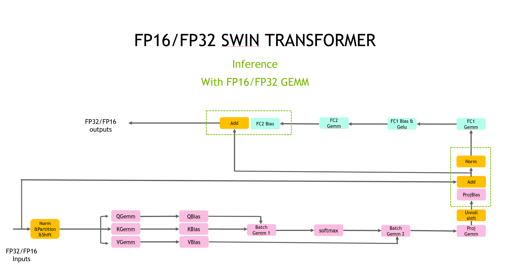
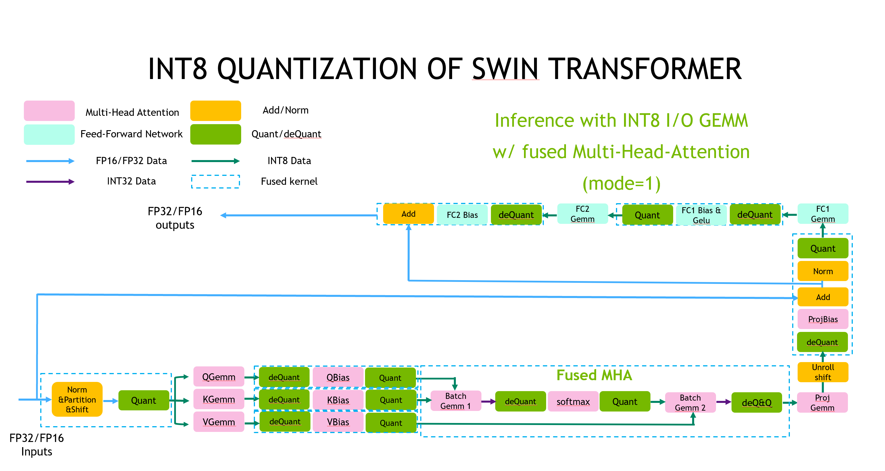

# Faster Swin-Transformer
The Faster Swin-Transformer contains the Swin-Transformer model, a state-of-the-art vision transformer model which was presented in [Swin Transformer: Hierarchical Vision Transformer using Shifted Windows](https://arxiv.org/pdf/2103.14030). The abstract of the paper is the following:

>This paper presents a new vision Transformer, called
Swin Transformer, that capably serves as a general-purpose
backbone for computer vision. Challenges in adapting
Transformer from language to vision arise from differences
between the two domains, such as large variations in the
scale of visual entities and the high resolution of pixels
in images compared to words in text. To address these
differences, we propose a hierarchical Transformer whose
representation is computed with Shifted windows. The
shifted windowing scheme brings greater efficiency by limiting self-attention computation to non-overlapping local
windows while also allowing for cross-window connection.
This hierarchical architecture has the flexibility to model
at various scales and has linear computational complexity
with respect to image size. These qualities of Swin Transformer make it compatible with a broad range of vision
tasks, including image classification (87.3 top-1 accuracy
on ImageNet-1K) and dense prediction tasks such as object
detection (58.7 box AP and 51.1 mask AP on COCO testdev) and semantic segmentation (53.5 mIoU on ADE20K
val). Its performance surpasses the previous state-of-theart by a large margin of +2.7 box AP and +2.6 mask AP on
COCO, and +3.2 mIoU on ADE20K, demonstrating the potential of Transformer-based models as vision backbones.
The hierarchical design and the shifted window approach
also prove beneficial for all-MLP architectures. The code
and models are publicly available at https://github.com/microsoft/Swin-Transformer.

Our implementation is aligned with the official PyTorch implementation [Swin-Transformer Github](https://github.com/microsoft/Swin-Transformer).

## Table of Contents
- [Faster Swin-Transformer](#faster-swin-transformer)
  - [Table of Contents](#table-of-contents)
  - [Swin-Transformer Computation Flow](#swin-transformer-computation-flow)
  - [Demo](#demo)
    - [Requirements](#requirements)
    - [Setup](#setup)
    - [Run](#run)
      - [Run Swin-Transformer on C++](#run-swin-transformer-on-c)
      - [Run with PyTorch op](#run-with-pytorch-op)
      - [Run with TensorRT plugin](#run-with-tensorrt-plugin)
  - [Performance](#performance)
    - [Swin Performance on T4](#swin-performance-on-t4)
      - [FP32](#fp32)
      - [FP16](#fp16)
      - [INT8](#int8)
    - [Swin Performance on A100](#swin-performance-on-a100)
      - [TF32](#tf32)
      - [FP16](#fp16-1)
      - [INT8](#int8-1)

## Swin-Transformer Computation Flow
<div align=center></div>
<div align=center>Fig. 1 Flowchart of FP16/FP32 Swin-Transformer.</div>

<div align=center></div>
<div align=center>Fig. 2 Flowchart of INT8 Swin-Transformer (with fused MHA and int8-mode=1).</div>

## Demo

In this demo, you can run Faster Swin-Transformer as a C++ program.

### Requirements

- CMake >= 3.13 for PyTorch
- CUDA 11.0 or newer version
- NCCL 2.10 or newer version
- Python 3 is recommended because some features are not supported in python 2
- PyTorch: Verify on 1.10.0, >= 1.5.0 should work.

Recommand to use image `nvcr.io/nvidia/pytorch:21.07-py3`.  

> docker run -ti --gpus all --rm nvcr.io/nvidia/pytorch:21.07-py3 bash

### Setup

1. Start the docker container, ensure mounting the project directory into it. For example:
    ```bash
    docker run \
        -it \
        --rm \
        --gpus=all \
        -v {YOUR_FASTER_TRANSFORMER_PROJECT_DIR_ON_HOST}:/workspace/FasterTransformer \
        --workdir /workspace/FasterTransformer \
        nvcr.io/nvidia/pytorch:21.07-py3 bash
    export WORKSPACE = /workspace/FasterTransformer
    ```

Here, we use `nvcr.io/nvidia/pytorch:21.07-py3`, you can also switch it to another CUDA-enabled PyTorch containers, but need to comply with the previous requirements.

2. Build the FasterTransformer with C++:
    ```bash
    cd $WORKSPACE
    git submodule update --init
    mkdir -p build
    cd build
    cmake -DSM=xx -DCMAKE_BUILD_TYPE=Release -DBUILD_PYT=ON -DBUILD_TRT=ON ..
    make
    ```
Note: **xx** is the compute capability of your GPU. For example, 60 (P40) or 61 (P4) or 70 (V100) or 75(T4) or 80 (A100).

### Run  

#### Run Swin-Transformer on C++

Firstly we use `./bin/swin_gemm` as the tool to search the best GEMM configuration. And then run `./bin/swin_example` or `./bin/swin_int8_example`.\
Data Type = 0 (FP32) or 1 (FP16) or 2 (BF16)
```bash
# is_fp16=0 indicates FP32, is_fp16=1 indicates FP16
# model_type={0,1,2,3,4,5}
#   0: swin-TINY with window size 7x7
#   1: swin-SMALL with window size 7x7
#   2: swin-BASE with window size 7x7
#   3: swin-BASE with window size 12x12
#   4: swin-LARGE with window size 7x7
#   5: swin-LARGE with window size 12x12
./bin/swin_gemm <batch_size> <image_width> <window_width> <head_number of the first block> <size_per_head> <data_type> <is_use_int8> 
./bin/swin_example <is_fp16> <model_type[0-5]> <batch_size>
./bin/swin_int8_example <model_type[0-5]> <batch_size>
```
Take swin-TINY with batch=32 as an example:
```bash
# Run Swin-Transformer(TINY) under FP32 on C++:
./bin/swin_gemm 32 224 7 3 32 0 0
./bin/swin_example 0 0 32 

# Run Swin-Transformer(TINY) under FP16 on C++
./bin/swin_gemm 32 224 7 3 32 1 0
./bin/swin_example 1 0 32 

# Run Swin-Transformer(TINY) under INT8 on C++
./bin/swin_gemm 32 224 7 3 32 0 1
./bin/swin_int8_example 0 32 
```

#### Run with PyTorch op
Download checkpoint
```bash
cd $WORKSPACE/examples/pytorch/swin/Swin-Transformer-Quantization
wget https://github.com/SwinTransformer/storage/releases/download/v1.0.0/swin_tiny_patch4_window7_224.pth
```

**Run FP16/FP32 pytorch op** 
```bash
cd $WORKSPACE/examples/pytorch/swin
pip install timm==0.4.12
pip install termcolor==1.1.0

bash -x run_test.sh <batch_size> ##profile of FP16/FP32 model
```

**Run INT8 pytorch op** 
1. Get calibrated checkpoint

    Refer to [Guide of Swin-Transformer Quantization Toolkit](../examples/pytorch/swin/Swin-Transformer-Quantization/README.md#usage) when installing dependencies and setting up datasets
```bash
cd $WORKSPACE/examples/pytorch/swin/Swin-Transformer-Quantization
python -m torch.distributed.launch --nproc_per_node 1 \
  --master_port 12345 main.py \
  --calib \
  --cfg SwinTransformer/configs/swin_tiny_patch4_window7_224.yaml \
  --resume swin_tiny_patch4_window7_224.pth \
  --data-path <imagenet-path> \ 
  --num-calib-batch 10 \
  --calib-batchsz 8\
  --int8-mode 1\
  --calib-output-path calib-checkpoint

```
**NOTE**: If you **ONLY** want to use PTQ instead of QAT: when calibrating TINY/SMALL/BASE model, `--int8-mode 1` suffices. When calibrating LARGE model, we have to specify `--int8-mode 2` instead of `--int8-mode 1`. The reason is, `Swin-L` is much harder to quantize, and we have to disable more quantization nodes in order to obtain satisfactory PTQ accuracy results. 

(When `int8_mode=1`, all GEMMs are INT8-in-INT8-out.
When `int8_mode=2`, GEMM of all `fc2` layers and `patchMerge` are relaxed to INT8-in-INT32-out, while other GEMMs keep INT8-I/O. )

If you want to insists on using `--int8-mode 1` for LARGE model (because speed of mode=1 is much faster), we recommend using QAT to finetune paramters of LARGE checkpoint.

2. Run test
```bash
cd $WORKSPACE/examples/pytorch/swin
pip install timm==0.4.12
pip install termcolor==1.1.0

bash -x run_test_int8.sh batch_size ##profile of INT8 model
bash -x run_test_int8_accuracy.sh batch_size ##test accuracy of INT8 model
```
Note: When testing PTQ accuracy for INT8 Swin-LARGE, we have to specify `--int8-mode 2` instead of `--int8-mode 1` in **run_test_int8.sh**.

However, if you have finetuned a Swin-LARGE using QAT and `--int8-mode 1`, then you can do inference with `--int8-mode 1` too. In a word, consistency have to be ensured.

3. Accuracy loss of INT8 Post-Training-Quantization(PTQ) compared with FP16

|  name  | resolution | acc@1  | acc@5  |    acc@1(I)    |    acc@5(I)    |
| :----: | :--------: | :----: | :----: | :------------: | :------------: |
| Swin-T |  224x224   | 81.182 | 95.522 | 80.748(-0.434) | 95.328(-0.194) |
| Swin-S |  224x224   | 83.214 | 96.242 | 82.904(-0.288) | 96.196(-0.036) |
| Swin-B |  224x224   | 83.424 | 96.446 | 83.116(-0.354) | 96.322(-0.144) |
| Swin-B |  384x384   | 84.474 | 96.956 | 84.034(-0.440) | 96.782(-0.174) |
| Swin-L |  224x224   | 86.246 | 97.876 | 85.892(-0.354) | 97.822(-0.054) |
| Swin-L |  384x384   | 87.246 | 98.248 | 86.916(-0.330) | 98.174(-0.074) |

#### Run with TensorRT plugin
**FP16/FP32 TensorRT plugin** 
```bash
cd $WORKSPACE/examples/tensorrt/swin
#FP16 engine build & infer
sh run_builder_fp16.sh
sh run_infer_fp16.sh batch_size
#FP32 engine build & infer
sh run_builder_fp32.sh
sh run_infer_fp32.sh batch_size
```

**INT8 TensorRT plugin** 
```bash
cd $WORKSPACE/examples/tensorrt/swin
#INT8 engine build & infer
sh run_builder_int8.sh
sh run_infer_int8.sh batch_size
```

## Performance  

Hardware settings:
* T4 (with mclk 5000MHz, pclk 1590MHz) with  Intel(R) Xeon(R) Gold 6132 CPU @ 2.60GHz
* A100 (with mclk 1215, pclk 1410MHz) with  Intel(R) Xeon(R) Gold 6132 CPU @ 2.60GHz

Software settings:
* CUDA 11.4

We here compared the performance between Swin-Transformer and FT Swin-Transformer on T4 & A100. Here we used Swin-TINY as an example, and the hyper-parameters of the model are:

* head_num = {3,6,12,24}
* size_per_head = 32
* num_of_blocks = {2,2,6,2}

### Swin Performance on T4
Here, `torch.jit.trace` means using tracing to convert Torch model to TorchScript model and then profile its performace. 
#### FP32
| Batch_size | torch.jit.trace |  cpp   | speedup | trt plugin | speedup | torch op | speedup |
| :--------: | :-------------: | :----: | :-----: | :--------: | :-----: | :------: | :-----: |
|     1      |      12.10      |  4.60  |  2.63   |    4.86    |  2.49   |   4.66   |  2.60   |
|     8      |      36.94      | 28.70  |  1.29   |   30.42    |  1.21   |  29.45   |  1.25   |
|     16     |      72.17      | 55.90  |  1.29   |   60.35    |  1.20   |  57.72   |  1.25   |
|     32     |     142.30      | 108.60 |  1.31   |   118.00   |  1.21   |  112.57  |  1.26   |

#### FP16
| Batch_size | torch.jit.trace |  cpp  | speedup | trt plugin | speedup | torch op | speedup |
| :--------: | :-------------: | :---: | :-----: | :--------: | :-----: | :------: | :-----: |
|     1      |      10.81      | 1.40  |  7.72   |    1.48    |  7.30   |   2.15   |  5.03   |
|     8      |      18.77      | 6.80  |  2.76   |    7.32    |  2.56   |   7.00   |  2.68   |
|     16     |      37.63      | 13.30 |  2.83   |   14.52    |  2.59   |  13.87   |  2.71   |
|     32     |      75.36      | 26.10 |  2.89   |   28.98    |  2.60   |  27.70   |  2.72   |

#### INT8
| Batch_size | torch.jit.trace |  cpp  | speedup(vs FP16) | trt plugin | speedup(vs FP16) | torch op | speedup(vs FP16) |
| :--------: | :-------------: | :---: | :--------------: | :--------: | :--------------: | :------: | :--------------: |
|     1      |                 | 1.24  |       1.13       |    1.27    |       1.17       |   1.24   |       1.73       |
|     8      |                 | 4.83  |       1.41       |    5.46    |       1.34       |   5.16   |       1.36       |
|     16     |                 | 9.73  |       1.37       |   11.03    |       1.32       |  10.32   |       1.34       |
|     32     |                 | 19.19 |       1.36       |   21.78    |       1.33       |  20.46   |       1.35       |

INT8 vs. FP16 speedup on Swin TINY/SMALL/BASE/LARGE:
| Batch_size | TINY (FP16) | TINY (INT8) | Speedup | SMALL (FP16) | SMALL (INT8) | Speedup | BASE (FP16) | BASE (INT8) | Speedup | LARGE (FP16) | LARGE (INT8) | Speedup |
| :--------: | :---------: | :---------: | :-----: | :----------: | :----------: | :-----: | :---------: | :---------: | :-----: | :----------: | :----------: | :-----: |
|     1      |    1.40     |    1.24     |  1.13   |     2.54     |     2.24     |  1.13   |    3.40     |    2.72     |  1.25   |     6.19     |     3.99     |  1.55   |
|     8      |    6.80     |    4.83     |  1.41   |    11.31     |     7.80     |  1.45   |    17.28    |    11.20    |  1.54   |    31.14     |    19.58     |  1.59   |
|     16     |    13.30    |    9.73     |  1.37   |    22.40     |    15.60     |  1.44   |    32.51    |    21.88    |  1.49   |    61.32     |    39.58     |  1.55   |
|     32     |    26.10    |    19.19    |  1.36   |    44.04     |    30.66     |  1.44   |    64.53    |    42.84    |  1.51   |    121.06    |    76.34     |  1.59   |

### Swin Performance on A100
Here, `torch.jit.trace` means using tracing to convert Torch model to TorchScript model and then profile its performace. 
#### TF32
On chips with Ampere architectures (like A30, A100), user can use `export NVIDIA_TF32_OVERRIDE=1` to enforce the program run under TF32, otherwise FP32 GEMM is used by default, which is much slower.
| Batch_size | torch.jit.trace |  cpp  | speedup | trt plugin | speedup | torch op | speedup |
| :--------: | :-------------: | :---: | :-----: | :--------: | :-----: | :------: | :-----: |
|     1      |      7.04       | 1.58  |  4.46   |    1.61    |  4.37   |   1.92   |  3.67   |
|     8      |      6.99       | 4.89  |  1.43   |    5.30    |  1.32   |   4.89   |  1.43   |
|     16     |      11.82      | 8.78  |  1.35   |    9.56    |  1.24   |   8.89   |  1.33   |
|     32     |      22.74      | 16.91 |  1.34   |   18.44    |  1.23   |  16.88   |  1.35   |

#### FP16
| Batch_size | torch.jit.trace |  cpp  | speedup | trt plugin | speedup | torch op | speedup |
| :--------: | :-------------: | :---: | :-----: | :--------: | :-----: | :------: | :-----: |
|     1      |      7.02       | 0.90  |  7.80   |    0.93    |  7.55   |   1.46   |  4.81   |
|     8      |      7.17       | 1.73  |  4.14   |    1.83    |  3.92   |   1.77   |  4.05   |
|     16     |      7.92       | 2.91  |  2.72   |    3.08    |  2.57   |   2.94   |  2.69   |
|     32     |      14.76      | 5.38  |  2.74   |    5.77    |  2.56   |   5.43   |  2.72   |

#### INT8
| Batch_size | torch.jit.trace |  cpp  | speedup(vs FP16) | trt plugin | speedup(vs FP16) | torch op | speedup(vs FP16) |
| :--------: | :-------------: | :---: | :--------------: | :--------: | :--------------: | :------: | :--------------: |
|     1      |                 | 1.07  |       0.84       |    1.13    |       0.82       |   1.08   |       1.35       |
|     8      |                 | 1.62  |       1.07       |    1.73    |       1.06       |   1.63   |       1.09       |
|     16     |                 | 2.34  |       1.24       |    2.50    |       1.23       |   2.34   |       1.26       |
|     32     |                 | 3.96  |       1.36       |    4.27    |       1.35       |   4.07   |       1.33       |

INT8 vs. FP16 speedup on Swin TINY/SMALL/BASE/LARGE:
| Batch_size | TINY (FP16) | TINY (INT8) | Speedup | SMALL (FP16) | SMALL (INT8) | Speedup | BASE (FP16) | BASE (INT8) | Speedup | LARGE (FP16) | LARGE (INT8) | Speedup |
| :--------: | :---------: | :---------: | :-----: | :----------: | :----------: | :-----: | :---------: | :---------: | :-----: | :----------: | :----------: | :-----: |
|     1      |    0.90     |    1.07     |  0.84   |     1.64     |     2.02     |  0.81   |    1.81     |    2.20     |  0.82   |     2.22     |     2.66     |  0.83   |
|     8      |    1.73     |    1.62     |  1.07   |     3.02     |     2.85     |  1.06   |    3.60     |    3.33     |  1.08   |     6.04     |     4.61     |  1.31   |
|     16     |    2.91     |    2.34     |  1.24   |     4.79     |     3.94     |  1.22   |    6.11     |    4.81     |  1.27   |    10.92     |     7.55     |  1.45   |
|     32     |    5.38     |    3.96     |  1.36   |     8.60     |     6.42     |  1.34   |    11.42    |    8.29     |  1.38   |    20.49     |    13.82     |  1.48   |
|     64     |    10.31    |    7.42     |  1.39   |    16.48     |    11.74     |  1.40   |    22.26    |    15.85    |  1.40   |    39.62     |    27.25     |  1.45   |
