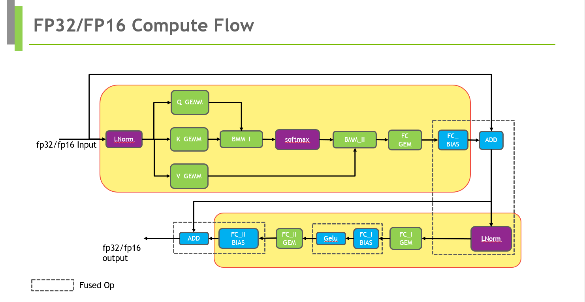
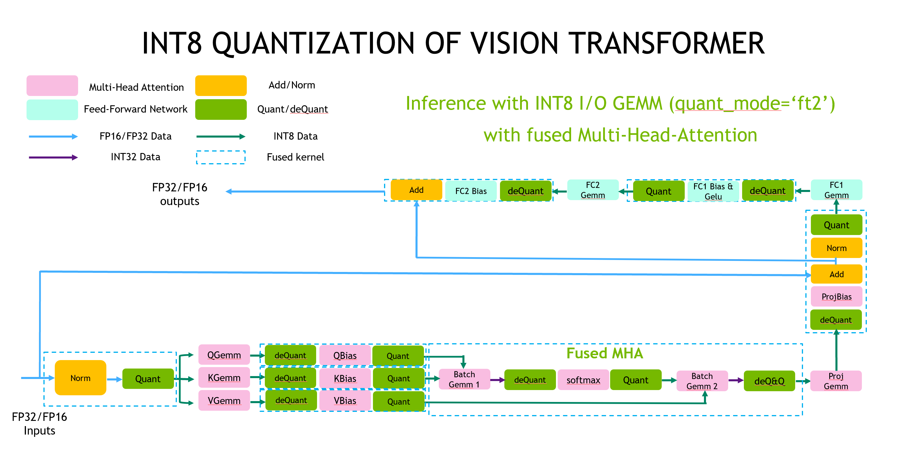

# Faster Vision Transformer(ViT)
The Faster Transformer contains the Vision Transformer model which was presented in [An Image is Worth 16x16 Words: Transformers for Image Recognition at Scale](https://arxiv.org/abs/2010.11929). The abstract of the paper is the following:

>While the Transformer architecture has become the de-facto standard for natural
language processing tasks, its applications to computer vision remain limited. In
vision, attention is either applied in conjunction with convolutional networks, or
used to replace certain components of convolutional networks while keeping their
overall structure in place. We show that this reliance on CNNs is not necessary
and a pure transformer applied directly to sequences of image patches can perform
very well on image classification tasks. When pre-trained on large amounts of
data and transferred to multiple mid-sized or small image recognition benchmarks
(ImageNet, CIFAR-100, VTAB, etc.), Vision Transformer (ViT) attains excellent
results compared to state-of-the-art convolutional networks while requiring substantially
fewer computational resources to train.

Our implementation is aligned with OpenSource PyTorch implementation [ViT Github](https://github.com/jeonsworld/ViT-pytorch).

## Table of Contents
- [Faster Vision Transformer(ViT)](#faster-vision-transformervit)
  - [Table of Contents](#table-of-contents)
  - [Computation Flow](#computation-flow)
  - [Demo](#demo)
    - [Requirements](#requirements)
    - [Setup](#setup)
    - [Run](#run)
      - [Run ViT on C++](#run-vit-on-c)
      - [Run with PyTorch op](#run-with-pytorch-op)
      - [Run with TensorRT plugin](#run-with-tensorrt-plugin)
  - [Performance](#performance)
    - [ViT Performance on T4](#vit-performance-on-t4)
      - [FP32](#fp32)
      - [FP16](#fp16)
      - [INT8](#int8)
    - [ViT Performance on A100](#vit-performance-on-a100)
      - [FP32](#fp32-1)
      - [FP16](#fp16-1)
      - [INT8](#int8-1)
      - [INT8 vs. FP16 speedup on ViT:](#int8-vs-fp16-speedup-on-vit)

## Computation Flow
<div align=center></div>
<div align=center>Fig. 1 Flowchart of FP16/FP32 ViT.</div>

<div align=center></div>
<div align=center>Fig. 2 Flowchart of INT8 ViT (with fused MHA and quant_mode='ft2').</div>

## Demo

In this demo, you can run Faster ViT as a C++ program.

### Requirements

- CMake >= 3.13 for PyTorch
- CUDA 11.0 or newer version
- NCCL 2.10 or newer version
- Python 3 is recommended because some features are not supported in python 2
- PyTorch: Verify on 1.10.0, >= 1.5.0 should work.

Recommand to use image `nvcr.io/nvidia/pytorch:21.07-py3`.  

> docker run -ti --gpus all --rm nvcr.io/nvidia/pytorch:21.07-py3 bash

### Setup

1. Start the docker container, ensure mounting the project directory into it. For example:
    ```bash
    docker run \
        -it \
        --rm \
        --gpus=all \
        "--cap-add=SYS_ADMIN" \
        --shm-size=16g \
        --ulimit memlock=-1 \
        --ulimit stack=67108864 \
        -v {YOUR_FASTER_TRANSFORMER_PROJECT_DIR_ON_HOST}:/workspace/FasterTransformer \
        --workdir /workspace/FasterTransformer \
        nvcr.io/nvidia/pytorch:21.07-py3 bash
    export WORKSPACE = /workspace/FasterTransformer
    ```
    Here, we use `nvcr.io/nvidia/pytorch:21.07-py3`, you can also switch it to another CUDA-enabled PyTorch containers, but need to comply with the previous requirements.

2.  Install additional dependencies (not included by container)
    ```bash
    cd $WORKSPACE
    pip install -r examples/pytorch/vit/requirement.txt
    ```

3. Build the FasterTransformer with C++:
    ```bash
    cd $WORKSPACE
    git submodule update --init
    mkdir -p build
    cd build
    cmake -DSM=xx -DCMAKE_BUILD_TYPE=Release -DBUILD_PYT=ON -DBUILD_TRT=ON ..
    make
    ```
    Note: **xx** is the compute capability of your GPU. For example, 60 (P40) or 61 (P4) or 70 (V100) or 75(T4) or 80 (A100).

### Run  

#### Run ViT on C++

Firstly we use `./bin/vit_gemm` as the tool to search the best GEMM configuration. And then run `./bin/vit_example` or `./bin/vit_int8_example`.
```bash
# is_fp16=0 indicates FP32, is_fp16=1 indicates FP16
# with_cls_token=1 indicates concatenated class token in feature embedding, with_cls_token=0 indicates no class token in feature embedding.
./bin/vit_gemm <batch_size> <img_size> <patch_size> <embed_dim> <head_number> <with_cls_token> <is_fp16> <int8_mode> 
./bin/vit_example <batch_size> <img_size> <patch_size> <embed_dim> <head_number> <layer_num> <with_cls_token> <is_fp16>
./bin/vit_int8_example <batch_size> <img_size> <patch_size> <embed_dim> <head_number> <layer_num> <with_cls_token> <is_fp16> <int8_mode>
```
Take ViT-B_16 with batch=32 and w=h=384 as an example:
```bash
# Run ViT-B_16 under FP32 on C++:
./bin/vit_gemm 32 384 16 768 12 1 0 0
./bin/vit_example 32 384 16 768 12 12 1 0

# Run ViT-B_16 under FP16 on C++
./bin/vit_gemm 32 384 16 768 12 1 1 0
./bin/vit_example 32 384 16 768 12 12 1 1

# Run ViT-B_16 under INT8 on C++
./bin/vit_gemm 32 384 16 768 12 1 1 2
./bin/vit_int8_example 32 384 16 768 12 12 1 1 2 
```

#### Run with PyTorch op
Download Pre-trained model (Google's Official Checkpoint)
```bash
cd $WORKSPACE/examples/pytorch/vit/ViT-quantization
# MODEL_NAME={ViT-B_16-224, ViT-B_16, ViT-B_32, ViT-L_16-224, ViT-L_16, ViT-L_32}
# wget https://storage.googleapis.com/vit_models/imagenet21k+imagenet2012/{MODEL_NAME}.npz
wget https://storage.googleapis.com/vit_models/imagenet21k+imagenet2012/ViT-B_16.npz
```

**Run FP16/FP32 pytorch op** 
```bash
cd $WORKSPACE/examples/pytorch/vit
pip install ml_collections

##profile of FP16/FP32 model
python infer_visiontransformer_op.py \
  --model_type=ViT-B_16  \
  --img_size=384 \
  --pretrained_dir=./ViT-quantization/ViT-B_16.npz \
  --batch-size=32 \
  --th-path=$WORKSPACE/build/lib/libpyt_vit.so
```

**Run INT8 pytorch op** 
1. Get calibrated checkpoint

Refer to [Guide of ViT Quantization Toolkit](../examples/pytorch/vit/ViT-quantization/README.md#usage) for details on setting datasets, PTQ and QAT.
```bash
cd $WORKSPACE/examples/pytorch/vit/ViT-quantization
export DATA_DIR=Path to the dataset
export CKPT_DIR=Path to the ViT checkpoints
python -m torch.distributed.launch --nproc_per_node 1 \
    --master_port 12345 main.py \
    --calib \
    --name vit \
    --pretrained_dir $CKPT_DIR/ViT-B_16.npz \
    --data-path $DATA_DIR \
    --model_type ViT-B_16 \
    --img_size 384 \
    --num-calib-batch 20 \
    --calib-batchsz 8 \
    --quant-mode ft2 \
    --calibrator percentile \
    --percentile 99.99 \
    --calib-output-path $CKPT_DIR

```
**NOTE: Difference between `--quant-mode ft1` and `--quant-mode ft2`**:

`--quant-mode 1` indicates that all GEMMs are quantized to be INT8-in-INT32-out, while `--quant-mode 2` means quantizating all GEMMs to be INT8-in-INT8-out. This is a speed-versus-accuracy trade-off: `ft2` is faster in CUDA implementation but its accuracy is lower.
|   name   | resolution | Original Accuracy |  PTQ(mode=1)   |  PTQ(mode=2)   |
| :------: | :--------: | :---------------: | :------------: | :------------: |
| ViT-B_16 |  384x384   |      83.97%       | 82.57%(-1.40%) | 81.82%(-2.15%) |

In order to reduce the accuracy loss for `ft2`, QAT is a reasonable choice.


2. Run test
```bash
cd $WORKSPACE/examples/pytorch/vit
python infer_visiontransformer_int8_op.py \
    --model_type=ViT-B_16  \
    --img_size 384 \
    --calibrated_dir $CKPT_DIR/ViT-B_16_calib.pth \
    --batch-size=32 \
    --th-path=$WORKSPACE/build/lib/libpyt_vit.so \
    --quant-mode ft2
```

#### Run with TensorRT plugin
**FP16/FP32 TensorRT plugin** 
```bash
cd $WORKSPACE/examples/tensorrt/vit
#FP16 engine build & infer
python infer_visiontransformer_plugin.py \
  --model_type=ViT-B_16 \
  --img_size=384 \
  --pretrained_dir=$WORKSPACE/examples/pytorch/vit/ViT-quantization/ViT-B_16.npz \
  --plugin_path=../../../build/lib/libvit_plugin.so \
  --batch-size=32 \
  --fp16

#FP32 engine build & infer
python infer_visiontransformer_plugin.py \
  --model_type=ViT-B_16 \
  --img_size=384 \
  --pretrained_dir=$WORKSPACE/examples/pytorch/vit/ViT-quantization/ViT-B_16.npz \
  --plugin_path=../../../build/lib/libvit_plugin.so \
  --batch-size=32 

```

## Performance  

Hardware settings:
* T4 (with mclk 5000MHz, pclk 1590MHz) with  Intel(R) Xeon(R) Gold 6132 CPU @ 2.60GHz
* A100 (with mclk 1215, pclk 1410MHz) with  Intel(R) Xeon(R) Gold 6132 CPU @ 2.60GHz

Software settings:
* CUDA 11.4

We here compared the performance between Vision Transformer and FT Vision Transformer on T4 & A100. Here we used ViT-B_16 as an example, and the hyper-parameters of the model are:

* img_size = 384
* patches = 16
* head_num = 12
* embed_dim = 768
* num_of_layers = 12
* with_cls_token = 1

### ViT Performance on T4

#### FP32
| Batch_size | torch <br/> latency(ms) | cpp <br/> latency(ms) | speedup | trt plugin <br/> latency(ms) | speedup | torch op <br/> latency(ms) | speedup |
| :--------: | :---------------------: | :-------------------: | :-----: | :--------------------------: | :-----: | :------------------------: | :-----: |
|     1      |          36.79          |         33.92         |  1.08   |            35.94             |  1.02   |           34.94            |  1.05   |
|     8      |         295.55          |        259.98         |  1.13   |            276.95            |  1.06   |           264.08           |  1.11   |
|     16     |         571.62          |        533.05         |  1.07   |            526.4             |  1.08   |           525.36           |  1.08   |
|     32     |         1212.99         |        1123.58        |  1.07   |           1140.77            |  1.06   |          1116.38           |  1.08   |

#### FP16
| Batch_size | torch <br/> latency(ms) | cpp <br/> latency(ms) | speedup | trt plugin <br/> latency(ms) | speedup | torch op <br/> latency(ms) | speedup |
| :--------: | :---------------------: | :-------------------: | :-----: | :--------------------------: | :-----: | :------------------------: | :-----: |
|     1      |          18.48          |         9.01          |  2.05   |             9.25             |  1.99   |            9.19            |  2.01   |
|     8      |         161.72          |         65.59         |  2.46   |            66.51             |  2.43   |           68.23            |  2.37   |
|     16     |         330.52          |        131.48         |  2.51   |            134.87            |  2.45   |           137.9            |  2.39   |
|     32     |         684.27          |        263.17         |  2.60   |            263.54            |  2.59   |           294.23           |  2.32   |

#### INT8
| Batch_size | cpp <br/> latency(ms) | speedup(vs FP16) | torch op <br/> latency(ms) | speedup(vs FP16) |
| :--------: | :-------------------: | :--------------: | :------------------------: | :--------------: |
|     1      |         4.93          |       1.73       |            5.50            |       1.67       |
|     8      |         36.40         |       1.68       |           41.56            |       1.64       |
|     16     |         74.94         |       1.65       |           87.17            |       1.58       |
|     32     |        150.31         |       1.68       |           173.32           |       1.70       |

INT8 vs. FP16 speedup on ViT :
| Batch_size | B_16 (FP16) <br/> latency(ms) | B_16 (INT8) <br/> latency(ms) | Speedup | B_16-224 (FP16) <br/> latency(ms) | B_16-224 (INT8) <br/> latency(ms) | Speedup | L_16 (FP16) <br/> latency(ms) | L_16 (INT8) <br/> latency(ms) | Speedup | L_16-224 (FP16) <br/> latency(ms) | L_16-224 (INT8) <br/> latency(ms) | Speedup |
| :--------: | :---------------------------: | :---------------------------: | :-----: | :-------------------------------: | :-------------------------------: | :-----: | :---------------------------: | :---------------------------: | :-----: | :-------------------------------: | :-------------------------------: | :-----: |
|     1      |             8.53              |             4.93              |  1.73   |               3.43                |               2.16                |  1.59   |             23.45             |             13.10             |  1.79   |               9.69                |               5.04                |  1.92   |
|     8      |             61.07             |             36.40             |  1.68   |               14.46               |               8.37                |  1.73   |            177.54             |            103.66             |  1.71   |               47.55               |               24.38               |  1.95   |
|     16     |            123.55             |             74.94             |  1.65   |               28.77               |               16.67               |  1.73   |            358.70             |            211.89             |  1.69   |               90.30               |               47.29               |  1.91   |
|     32     |            253.20             |            150.31             |  1.68   |               57.22               |               35.43               |  1.62   |            748.81             |            425.36             |  1.76   |              171.89               |              101.25               |  1.70   |
 

### ViT Performance on A100

#### FP32
User can use `export NVIDIA_TF32_OVERRIDE=0` to enforce the program run under FP32 on Ampere GPU.
| Batch_size | torch <br/> latency(ms) | cpp <br/> latency(ms) | speedup | trt plugin <br/> latency(ms) | speedup | torch op <br/> latency(ms) | speedup |
| :--------: | :---------------------: | :-------------------: | :-----: | :--------------------------: | :-----: | :------------------------: | :-----: |
|     1      |          12.38          |         10.38         |  1.19   |            10.93             |  1.13   |            11.1            |  1.12   |
|     8      |          74.31          |         72.03         |  1.03   |            72.19             |  1.03   |           72.28            |  1.03   |
|     16     |         147.48          |         135.5         |  1.09   |            137.69            |  1.07   |           138.51           |  1.06   |
|     32     |          290.7          |        266.29         |  1.09   |            270.74            |  1.07   |           270.9            |  1.07   |

#### FP16
| Batch_size | torch <br/> latency(ms) | cpp <br/> latency(ms) | speedup | trt plugin <br/> latency(ms) | speedup | torch op <br/> latency(ms) | speedup |
| :--------: | :---------------------: | :-------------------: | :-----: | :--------------------------: | :-----: | :------------------------: | :-----: |
|     1      |          9.58           |         2.13          |  4.50   |             2.33             |  4.11   |            3.51            |  2.73   |
|     8      |          30.41          |         11.23         |  2.71   |            11.59             |  2.62   |           11.63            |  2.61   |
|     16     |          60.39          |         21.56         |  2.80   |              22              |  2.75   |            22.3            |  2.71   |
|     32     |         121.17          |         43.91         |  2.76   |            44.65             |  2.71   |           45.43            |  2.67   |

#### INT8
| Batch_size | cpp <br/> latency(ms) | speedup(vs FP16) | torch op <br/> latency(ms) | speedup(vs FP16) |
| :--------: | :-------------------: | :--------------: | :------------------------: | :--------------: |
|     1      |         2.26          |       0.99       |            2.38            |       1.47       |
|     8      |         7.93          |       1.41       |            8.45            |       1.38       |
|     16     |         14.66         |       1.47       |           15.91            |       1.40       |
|     32     |         29.07         |       1.51       |           31.78            |       1.43       |

#### INT8 vs. FP16 speedup on ViT:
| Batch_size | B_16 (FP16) <br/> latency(ms) | B_16 (INT8) <br/> latency(ms) | Speedup | B_16-224 (FP16) <br/> latency(ms) | B_16-224 (INT8) <br/> latency(ms) | Speedup | L_16 (FP16) <br/> latency(ms) | L_16 (INT8) <br/> latency(ms) | Speedup | L_16-224 (FP16) <br/> latency(ms) | L_16-224 (INT8) <br/> latency(ms) | Speedup |
| :--------: | :---------------------------: | :---------------------------: | :-----: | :-------------------------------: | :-------------------------------: | :-----: | :---------------------------: | :---------------------------: | :-----: | :-------------------------------: | :-------------------------------: | :-----: |
|     1      |             2.24              |             2.26              |  0.99   |               1.53                |               1.52                |  1.01   |             5.36              |             4.77              |  1.12   |               2.97                |               2.91                |  1.02   |
|     8      |             11.14             |             7.93              |  1.41   |               3.03                |               2.38                |  1.27   |             30.95             |             20.25             |  1.53   |               8.09                |               5.44                |  1.49   |
|     16     |             21.50             |             14.66             |  1.47   |               5.30                |               3.74                |  1.42   |             60.99             |             39.43             |  1.57   |               15.03               |               9.23                |  1.63   |
|     32     |             43.81             |             29.07             |  1.51   |               10.04               |               6.43                |  1.56   |            124.85             |             80.05             |  1.56   |               29.66               |               17.28               |  1.72   |


