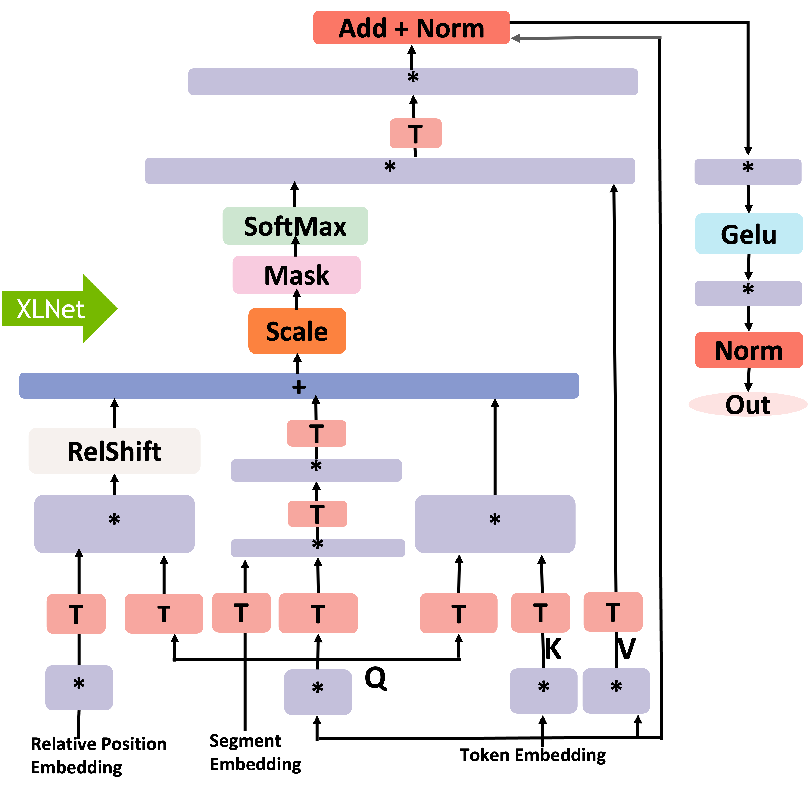

# FasterTransformer XLNet

The **FasterTransformer XLNet** contains the XLNet model, which is an extension of the Transformer-XL model pre-trained using an autoregressive method to learn bidirectional contexts by maximizing the expected likelihood over all permutations of the input sequence factorization order.

The XLNet model was presented in [XLNet: Generalized Autoregressive Pretraining for Language Understanding](https://arxiv.org/pdf/1906.08237.pdf). The abstract of the paper is the following:
>With the capability of modeling bidirectional contexts, denoising autoencoding based pretraining like BERT achieves better performance than pretraining approaches based on autoregressive language modeling. However, relying on corrupting the input with masks, BERT neglects dependency between the masked positions and suffers from a pretrain-finetune discrepancy. In light of these pros and cons, we propose XLNet, a generalized autoregressive pretraining method that enables learning bidirectional contexts by maximizing the expected likelihood over all permutations of the factorization order and overcomes the limitations of BERT thanks to its autoregressive formulation. Furthermore, XLNet integrates ideas from Transformer-XL, the state-of-the-art autoregressive model, into pretraining. Empirically, under comparable experiment settings, XLNet outperforms BERT on 20 tasks, often by a large margin, including question answering, natural language inference, sentiment analysis, and document ranking

This FasterTransformer XLNet implementation is aligned with [XLNet Github](https://github.com/zihangdai/xlnet).

## Table of Contents
- [FasterTransformer XLNet](#fastertransformer-xlnet)
  - [Table of Contents](#table-of-contents)
  - [XLNet Encoder Computation Flow](#xlnet-encoder-computation-flow)
  - [Demo](#demo)
    - [Requirements](#requirements)
    - [Setup](#setup)
    - [Run](#run)
      - [Run XLNet on C++](#run-xlnet-on-c)
      - [Verify the correctness](#verify-the-correctness)
  - [Performance](#performance)
    - [FP32](#fp32)
    - [FP16](#fp16)

## XLNet Encoder Computation Flow
<div align=center></div>
<div align=center>Fig. 1 Flowchart of XLNet.</div>

## Demo

In this demo, you can run the XLNet as a C++ program.

### Requirements

- CMake >= 3.8
- CUDA 11.0 or newer version
- NCCL 2.10 or newer version
- Python 3 is recommended because some features are not supported in python 2
- Tensorflow: Verify on 1.15, 1.13 and 1.14 should work.

Recommand to use image `nvcr.io/nvidia/tensorflow:20.12-tf1-py3`.  

```bash
docker run -ti --gpus all --rm nvcr.io/nvidia/tensorflow:20.12-tf1-py3 bash
```

### Setup

1. Start the docker container, ensure mounting the project directory into it. For example:
    ```bash
    docker run \
        -it \
        --rm \
        --gpus=all \
        -v {YOUR_FASTER_TRANSFORMER_PROJECT_DIR_ON_HOST}:/workspace/FasterTransformer \
        --workdir /workspace/FasterTransformer \
        nvcr.io/nvidia/tensorflow:20.12-tf1-py3 bash
        
    cd /workspace/FasterTransformer
    ```

Here, we use `nvcr.io/nvidia/tensorflow:20.12-tf1-py3`, you can also switch it to another CUDA-enabled Tensorflow containers, but need to comply with the previous requirements.

2. Build the FasterTransformer with C++:
    ```bash
    mkdir -p build
    cd build
    cmake -DSM=xx -DCMAKE_BUILD_TYPE=Release ..
    make
    ```
Note: **xx** is the compute capability of your GPU. For example, 60 (P40) or 61 (P4) or 70 (V100) or 75(T4) or 80 (A100).  
### Run  
```bash
cd /workspace/FasterTransformer/build
```
#### Run XLNet on C++


```bash
./bin/xlnet_gemm <batch_size> <sequence_length> <head_number> <size_per_head> <is_use_fp16>
./bin/xlnet_example <batch_size> <num_layers> <sequence_length> <head_number> <size_per_head> <data_type>
```
Data Type = 0 (FP32) or 1 (FP16) or 2 (BF16)
- Run XLNet under FP32 on C++
```bash
./bin/xlnet_gemm 8 128 12 64 0
./bin/xlnet_example 8 12 128 12 64 0 
```

- Run XLNet under FP16 on C++
```bash
./bin/xlnet_gemm 8 128 12 64 1
./bin/xlnet_example 8 12 128 12 64 1 
```

- Run XLNet under FP16 on C++
```bash
./bin/xlnet_gemm 8 128 12 64 2
./bin/xlnet_example 8 12 128 12 64 2
```

#### Verify the correctness  
```bash
cd  examples/tensorflow/xlnet
bash downloadModel.sh #Dowload the input and model data
bash verifyCorrectness.sh # For FP32 model
bash verifyCorrectness.sh -f 1 #For FP16 model
```
- Args for the verifyCorrectness.sh
```doc
Usage: bash verifyCorrectness_FP32.sh -d data_dir -m model_dir -s npz_dir -e gemm_file -g gpu_id -f is_use_fp16
        -d The directory of input data. Default: ./data/STS-B
        -n The data name. Default: sts-b
        -m The directory of the xlnet models. Default: ./data/xlnet_cased_L-12_H-768_A-12
        -s The directory which stores the generated npz files. Default: ./data
        -e The gemm file for selecting cublas functions. Default: ./gemm.in
        -g Specify which GPU to use. Default: 0
        -f Specify use float16 or not. 1 means run in float16 mode. Default: 0
```

## Performance  

Hardware settings:
* T4 (with mclk 5000MHz, pclk 1590MHz) with  Intel(R) Xeon(R) Gold 6132 CPU @ 2.60GHz

We here compared the performance between XLNet and FT XLNet on T4. The hyper-parameters of the model are:

* head_num = 12
* size_per_head = 64
* num_layers = 12

### FP32

| Batch_size | Seq_len | Precision | Tensorflow XLA Latency (ms) | FasterTransformers Latency (ms) | Speedup |
| :--------: | :-----: | :-------: | :-------------------------: | :-----------------------------: | :-----: |
|     16     |   128   |   FP32    |           135.49            |              91.20              |  1.49   |
|     32     |   128   |   FP32    |           271.12            |             186.88              |  1.45   |
|     64     |   128   |   FP32    |           535.80            |             398.14              |  1.35   |
|     16     |   384   |   FP32    |           646.19            |             381.30              |  1.69   |
|     32     |   384   |   FP32    |           1291.76           |             763.32              |  1.69   |
|     64     |   384   |   FP32    |           2751.80           |             1554.84             |  1.77   |
|     16     |   512   |   FP32    |           949.05            |             544.85              |  1.74   |
|     32     |   512   |   FP32    |           2057.27           |             1165.06             |  1.77   |
|     64     |   512   |   FP32    |           1771.6            |             2269.14             |  1.94   |

### FP16
| Batch_size | Seq_len | Precision | Tensorflow XLA Latency (ms) | FasterTransformers Latency (ms) | Speedup |
| :--------: | :-----: | :-------: | :-------------------------: | :-----------------------------: | :-----: |
|     16     |   128   |   FP16    |            53.04            |              26.08              |  2.03   |
|     32     |   128   |   FP16    |            84.76            |              51.78              |  1.64   |
|     64     |   128   |   FP16    |           151.09            |             106.12              |  1.42   |
|     16     |   384   |   FP16    |           228.29            |             132.78              |  1.72   |
|     32     |   384   |   FP16    |           528.38            |             255.89              |  2.06   |
|     64     |   384   |   FP16    |           1079.63           |             539.69              |  2.00   |
|     16     |   512   |   FP16    |           356.38            |             194.59              |  1.83   |
|     32     |   512   |   FP16    |           851.15            |             397.92              |  2.14   |
|     64     |   512   |   FP16    |           1771.6            |             773.58              |  2.29   |
