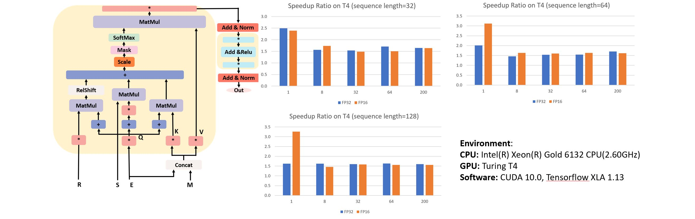

# | FasterXLNet

- In this project, we accelerate the inference process of XLNet on GPU using cuBLAS based on FasterTramsformer.    
- The referenced XLNet code is at [zihangdai/xlnet](https://github.com/zihangdai/xlnet/)    
- Figure below shows the basic workflow of the inference procedue of XLNet


# | Dependency
- Running FasterXLNet only relies on cuBLAS and CUDA. You don't need tensorflow or pytorch. 
- However, to compare FasterXLNet with [XLNet's tensorflow implementation](https://github.com/zihangdai/xlnet/) (run the code in folder `./python/`), you need tensorflow installed.
- To verify the correctness, you need to download the input data [GLUE DATA](https://gluebenchmark.com/tasks) and model data[XLNet-Base, Cased:12-layer,768-hidden,12-heads.](https://storage.googleapis.com/xlnet/released_models/cased_L-12_H-768_A-12.zip)
You can use the shell  `./example/downloadModel.sh` to get these data.
- We use the [cnpy](https://github.com/rogersce/cnpy) to read.npy and .npz files, this code is already included in our project.

# | Compile
We wrote a simple Makefile
```
GCC=g++
NVCC=nvcc
BUILDDIR=obj

CFLAGS= --std=c++11 -O3  -I.
FLAGS= --std=c++11 -O3  -gencode=arch=compute_61,code=sm_61  -gencode=arch=compute_70,code=sm_70 -gencode=arch=compute_75,code=sm_75 \
	   -I. -I/usr/local/cuda/include -lcudart -lcublas -lz
...
```
1. If the compute capabilty is not listed in the makefile, you can modify `-gencode=arch=compute_61,code=sm_61` according to your [GPU card and its compute capability](https://developer.nvidia.com/cuda-gpus). 
2. Run `make`. 

You will get the following output: 
```
nvcc -c -o obj/runXlnet.o runXlnet.cu --std=c++11 -O3  -gencode=arch=compute_61,code=sm_61  -gencode=arch=compute_70,code=sm_70 -gencode=arch=compute_75,code=sm_75 -I. -I/usr/local/cuda/include -lcudart -lcublas -lz
...
nvcc -c -o obj/runTest.o runTest.cu --std=c++11 -O3  -gencode=arch=compute_61,code=sm_61  -gencode=arch=compute_70,code=sm_70 -gencode=arch=compute_75,code=sm_75 -I. -I/usr/local/cuda/include -lcudart -lcublas -lz
nvcc -o runTest obj/runTest.o obj/LoadData.o obj/layerKernels.o obj/XlnetDebug.o obj/Xlnet.o obj/XlnetLayer.o obj/utils.o obj/cnpy.o --std=c++11 -O3  -gencode=arch=compute_61,code=sm_61  -gencode=arch=compute_70,code=sm_70 -gencode=arch=compute_75,code=sm_75 -I. -I/usr/local/cuda/include -lcudart -lcublas -lz
```
# | Try it first 
In code `runXlnet.cu`, we show the basic usage of this code. You can run it with command `./runXlnet`. 
You can get output
```
*****@*****:~/git/xlnet/xlnet_cpp/fasterxlnet$ ./runXlnet 
Using Device GeForce GTX 1080 Ti
Run layer 0
Run layer 1
...
Run layer 11
END
```
# | Run the code with proper settings
## || Generate the gemm file
- Our program needs to select the best cuBLAS function first. Related information is stored in a file whose name is specified by parameter `--gemm (-e)`. 
- Our program will check this file first. If it doesn't exit, we will select the cuBLAS function first. Otherwise, we will read the cuBLAS function information from this file.
- We provide some examples at `./gemm/`. For example, `./gemm/gemm.fp32.v100` is the function settings for GPU card V100 for precision FP32. If the GPU card and precision can be found at `./gemm/`, you can use it directly.

## || Compare the performance with tensorflow with XLA enabled
- `example/profileXLA.sh` run tensorflow first and run `runDebug` to show its performance.
-  This example use random number for the paramters and input. 
-  Needs one json file to specify the hyperparameters of the model. One example is in this repo `example/xlnet_config.json`. You can also use the json file from XLNet.
-  To run this example, first `cd example`, then run `bash profileXLA.sh`. You may get the output like:
```
****@d479a0b38bdb:/workspace/xlnet/fasterxlnet/example$ bash profileXLA.sh 
COMMAND: python3 ../python/runProfile.py -s 32 -b 1 -w 50 -t 100 -j ./xlnet_config.json
...
RUN_TIME: batch_size= 1  seq_len= 32 run_time= 1.3440299999999998 MS
COMMAND: ../runTest -m 2 -g 0 -e ../gemm/gemm.fp32.1080ti -s 32 -b 1 -w 50 -t 100 -j ./xlnet_config.json
...
RUN_TIME: batch_size= 1 seq_len= 32 run_time= 0.322898 MS
```

## || Verify the correctness
- In folder `example` we list two examples `example/verifyCorrectness_FP32.sh` and `example/verifyCorrectness_FP32.sh`to show how to verify its correctnes or show its performance.
- After run the `example/downloadModel.sh`, you can `cd example` and run these two examples with command `bash verifyCorrectness_FP32.sh` in the `example` directory. You may get the output like:
```
COMMAND: python ../python/convertInput.py -t sts-b -b 8 -d ../data/STS-B -l 128 -s ../data/xlnet_cased_L-12_H-768_A-12/spiece.model -o ../data/data.npz -u 0
Save Input to file ../data/data.npz
COMMAND: python ../python/convertModel.py -i ../data/xlnet_cased_L-12_H-768_A-12/xlnet_model.ckpt -o ../data/model.npz
0 model/transformer/layer_11/ff/LayerNorm/beta:0 (768,)
1 model/transformer/layer_5/ff/layer_1/bias:0 (3072,)
2 model/transformer/layer_7/ff/layer_1/bias:0 (3072,)
3 model/transformer/layer_1/ff/layer_2/kernel:0 (3072, 768)
...
COMMAND: python ../python/runData.py -i ../data/data.npz -o ../data/output.npz -j ../data/xlnet_cased_L-12_H-768_A-12/xlnet_config.json -m ../data/xlnet_cased_L-12_H-768_A-12/xlnet_model.ckpt -b 8 -l 128 -f 0 -n 0
USE FLOAT 16:  False
Get input batch int32, float32, int32
Tensor("model/transformer/Cast_1:0", shape=(128, 128, 8, 1), dtype=float32) Tensor("model/transformer/dropout/Identity:0", shape=(128, 8, 768), dtype=float32) Tensor("model/transformer/one_hot:0", shape=(128, 128, 8, 2), dtype=float32) Tensor("model/transformer/dropout_1/Identity:0", shape=(256, 8, 768), dtype=float32)
(128, 8, 12, 64)
(128, 8, 12, 64)
...
COMMAND: ../runTest -m 3 -b 8 -s 128 -q -g 0 -e ../gemm/gemm.fp32.1080ti -j ../data/xlnet_cased_L-12_H-768_A-12/xlnet_config.json -i ../data/data.npz -p ../data/model.npz -r ../data/output.npz
Read Json file, got the meta parameters:
...
COMMAND: python ../python/convertInput.py -t sts-b -b 8 -d ../data/STS-B -l 128 -s ../data/xlnet_cased_L-12_H-768_A-12/spiece.model -o ../data/data.npz -u 0
Save Input to file ../data/data.npz
COMMAND: python ../python/convertModel.py -i ../data/xlnet_cased_L-12_H-768_A-12/xlnet_model.ckpt -o ../data/model.npz
0 model/transformer/layer_11/ff/LayerNorm/beta:0 (768,)
1 model/transformer/layer_5/ff/layer_1/bias:0 (3072,)
2 model/transformer/layer_7/ff/layer_1/bias:0 (3072,)
3 model/transformer/layer_1/ff/layer_2/kernel:0 (3072, 768)
...
COMMAND: python ../python/runData.py -i ../data/data.npz -o ../data/output.npz -j ../data/xlnet_cased_L-12_H-768_A-12/xlnet_config.json -m ../data/xlnet_cased_L-12_H-768_A-12/xlnet_model.ckpt -b 8 -l 128 -f 0 -n 0
USE FLOAT 16:  False
Get input batch int32, float32, int32
Tensor("model/transformer/Cast_1:0", shape=(128, 128, 8, 1), dtype=float32) Tensor("model/transformer/dropout/Identity:0", shape=(128, 8, 768), dtype=float32) Tensor("model/transformer/one_hot:0", shape=(128, 128, 8, 2), dtype=float32) Tensor("model/transformer/dropout_1/Identity:0", shape=(256, 8, 768), dtype=float32)
(128, 8, 12, 64)
(128, 8, 12, 64)
(128, 8, 12, 64)
...
COMMAND: ../runTest -m 3 -b 8 -s 128 -q -g 0 -e ../gemm/gemm.fp32.1080ti -j ../data/xlnet_cased_L-12_H-768_A-12/xlnet_config.json -i ../data/data.npz -p ../data/model.npz -r ../data/output.npz
Read Json file, got the meta parameters:
batch_size=8, seq_len=128
size_per_head(d_head)= 64
hidden_dim_ff(d_inner)=3072
...
Result Correct
```

# | Simple Class description
## ||class Xlnet
class Xlnet consists of several layers and is responsible for preprocess of Xlnet network.
## || class XlnetLayer
class XlnetLayer is responsible for one layer.
## || class XlnetDebug
class XlnetDebug is resposible for the verification and timing of Xlnet.
## || data loaders
- class InpudData : Handle the input data
- class PreWeight : Handle preprocess part of model weight
- class LayerWeight : Handle layer weight
